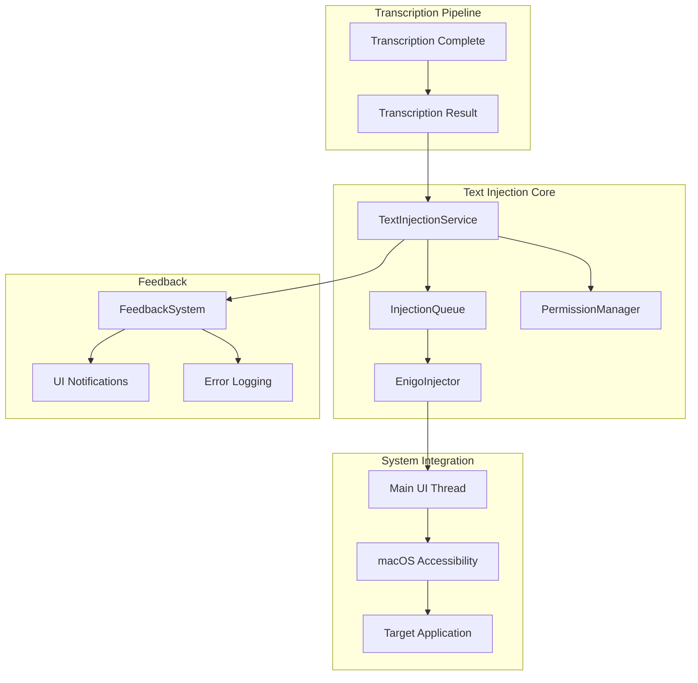

# Design Document

## Overview

The Text Injection feature provides synthetic keyboard input to type transcribed text into the
currently focused application using the `enigo` crate. The system simulates natural typing behavior
while maintaining high performance and cross-application compatibility. The design emphasizes thread
safety, accessibility compliance, and robust error handling to ensure reliable text injection across
all macOS applications.

## Architecture

The text injection system follows a service-oriented architecture with clear separation between
injection logic, platform integration, and error handling:

- **TextInjectionService**: Core service managing text injection operations
- **EnigoInjector**: Platform-specific implementation using the `enigo` crate
- **PermissionManager**: Handles macOS accessibility permission requirements
- **InjectionQueue**: Manages queued injection requests and rate limiting
- **FeedbackSystem**: Provides completion events and error reporting

### Component Interaction



## Components and Interfaces

### TextInjectionService

**Location**: `speakr-core/src/injection/service.rs`

**Responsibilities**:

- Coordinate text injection operations
- Manage injection queue and rate limiting
- Handle permission checking and error recovery
- Provide async API for transcription pipeline integration

**Key Methods**:

```rust
impl TextInjectionService {
    pub async fn new() -> Result<Self, InjectionError>
    pub async fn inject_text(&self, text: String) -> Result<InjectionResult, InjectionError>
    pub async fn check_permissions(&self) -> Result<PermissionStatus, InjectionError>
    pub fn is_ready(&self) -> bool
    pub fn get_status(&self) -> ServiceStatus
}
```

### EnigoInjector

**Location**: `speakr-core/src/injection/enigo_impl.rs`

**Responsibilities**:

- Interface with the `enigo` crate for synthetic input
- Handle character encoding and special character injection
- Manage typing speed and natural timing simulation
- Execute injection on the main UI thread

**Key Methods**:

```rust
impl EnigoInjector {
    pub fn new() -> Result<Self, InjectionError>
    pub async fn type_text(&self, text: &str) -> Result<(), InjectionError>
    pub fn set_typing_speed(&mut self, chars_per_second: u32)
    pub fn validate_text(&self, text: &str) -> Result<(), InjectionError>
}
```

### InjectionQueue

**Location**: `speakr-core/src/injection/queue.rs`

**Responsibilities**:

- Queue multiple injection requests
- Prevent concurrent injections that could interfere
- Provide cancellation support for queued requests
- Rate limit injection requests to prevent system overload

**Key Methods**:

```rust
impl InjectionQueue {
    pub fn new() -> Self
    pub async fn enqueue(&self, request: InjectionRequest) -> Result<InjectionHandle, InjectionError>
    pub async fn cancel(&self, handle: InjectionHandle) -> Result<(), InjectionError>
    pub fn get_queue_length(&self) -> usize
}
```

## Data Models

### InjectionError

```rust
#[derive(Debug, Error, Clone, PartialEq)]
pub enum InjectionError {
    #[error("Accessibility permissions not granted")]
    PermissionDenied,

    #[error("Text injection failed: {0}")]
    InjectionFailed(String),

    #[error("Invalid text format: {0}")]
    InvalidText(String),

    #[error("No active input field found")]
    NoActiveInput,

    #[error("Injection timeout after {timeout_ms}ms")]
    Timeout { timeout_ms: u64 },

    #[error("System error: {0}")]
    SystemError(String),

    #[error("Injection cancelled by user")]
    Cancelled,
}
```

### InjectionResult

```rust
#[derive(Debug, Clone, PartialEq)]
pub struct InjectionResult {
    pub text_injected: String,
    pub characters_count: usize,
    pub injection_time: Duration,
    pub target_application: Option<String>,
    pub success: bool,
}
```

### InjectionRequest

```rust
#[derive(Debug, Clone)]
pub struct InjectionRequest {
    pub text: String,
    pub priority: InjectionPriority,
    pub timeout: Duration,
    pub preserve_formatting: bool,
}

#[derive(Debug, Clone, PartialEq)]
pub enum InjectionPriority {
    Low,
    Normal,
    High,
    Immediate,
}
```

### PermissionStatus

```rust
#[derive(Debug, Clone, PartialEq)]
pub enum PermissionStatus {
    Granted,
    Denied,
    NotDetermined,
    Restricted,
}
```

## Error Handling

### Permission Management

1. **Permission Checking**: Verify accessibility permissions before injection

   - Check permissions on service initialization
   - Provide clear guidance for granting permissions
   - Cache permission status to avoid repeated checks

2. **Permission Recovery**: Handle permission changes during runtime
   - Monitor permission status changes
   - Gracefully handle permission revocation
   - Provide user guidance for re-enabling permissions

### Injection Failures

1. **Target Application Issues**: When injection fails in specific applications

   - Log application-specific failure patterns
   - Provide application-specific troubleshooting guidance
   - Implement retry logic with exponential backoff

2. **System-Level Blocks**: When macOS blocks synthetic input

   - Detect system security restrictions
   - Provide clear error messages with resolution steps
   - Suggest alternative input methods when available

3. **Text Format Issues**: When text contains problematic characters
   - Validate text before injection to detect issues
   - Provide character encoding conversion when needed
   - Log problematic character sequences for debugging

## Performance Optimization

### Typing Speed Simulation

```rust
impl EnigoInjector {
    fn calculate_typing_delay(&self, char: char) -> Duration {
        match char {
            ' ' => Duration::from_millis(50),  // Faster for spaces
            '\n' => Duration::from_millis(100), // Slower for line breaks
            c if c.is_alphanumeric() => Duration::from_millis(20),
            _ => Duration::from_millis(30), // Punctuation and special chars
        }
    }

    async fn type_with_natural_timing(&self, text: &str) -> Result<(), InjectionError> {
        for char in text.chars() {
            self.enigo.text(&char.to_string())?;
            tokio::time::sleep(self.calculate_typing_delay(char)).await;
        }
        Ok(())
    }
}
```

### Memory Management

- **Text Chunking**: Break large text into smaller chunks for injection
- **Buffer Reuse**: Reuse string buffers to reduce allocations
- **Queue Management**: Limit queue size to prevent memory bloat

### Thread Safety

```rust
// Ensure injection runs on main thread for macOS compatibility
pub async fn inject_on_main_thread(text: String) -> Result<(), InjectionError> {
    let (tx, rx) = oneshot::channel();

    // Dispatch to main thread
    dispatch_main(move || {
        let result = perform_injection(&text);
        let _ = tx.send(result);
    });

    rx.await.map_err(|_| InjectionError::SystemError("Main thread dispatch failed".to_string()))?
}
```

## Integration Points

### Transcription Pipeline Integration

The text injection service receives transcribed text from the transcription system:

```rust
pub async fn handle_transcription_complete(
    result: TranscriptionResult,
    injection_service: &TextInjectionService,
) -> Result<(), AppError> {
    let injection_request = InjectionRequest {
        text: result.text,
        priority: InjectionPriority::Normal,
        timeout: Duration::from_secs(5),
        preserve_formatting: true,
    };

    injection_service.inject_text(injection_request.text).await
        .map_err(|e| AppError::TextInjection(e.to_string()))?;

    Ok(())
}
```

### Status Reporting Integration

Text injection status is reported through the existing status system:

```rust
impl TextInjectionService {
    pub fn update_status(&self, status: ServiceStatus) {
        // Update BackendStatus.text_injection
        self.status_service.update_service_status(
            ServiceComponent::TextInjection,
            status
        );
    }
}
```

### Settings Integration

Text injection behavior can be configured through settings:

```rust
#[derive(Debug, Clone, Serialize, Deserialize)]
pub struct InjectionSettings {
    pub typing_speed_cps: u32,  // Characters per second
    pub enable_natural_timing: bool,
    pub preserve_formatting: bool,
    pub injection_timeout_ms: u64,
}

impl Default for InjectionSettings {
    fn default() -> Self {
        Self {
            typing_speed_cps: 50,  // ~300ms for 100 chars
            enable_natural_timing: true,
            preserve_formatting: true,
            injection_timeout_ms: 5000,
        }
    }
}
```

## Testing Strategy

### Unit Tests

1. **Text Processing**: Test character encoding and special character handling
2. **Queue Management**: Test injection queuing and cancellation
3. **Error Handling**: Test all error scenarios and recovery mechanisms
4. **Performance**: Test injection timing and speed requirements

### Integration Tests

1. **Application Compatibility**: Test injection in target applications (VS Code, Xcode, Pages,
   Safari)
2. **Permission Handling**: Test permission checking and error recovery
3. **Pipeline Integration**: Test complete transcription → injection workflow
4. **Thread Safety**: Test main thread execution requirements

### Performance Benchmarks

1. **Injection Speed**: Measure time to inject 100 characters (target: <300ms)
2. **Memory Usage**: Monitor memory consumption during large text injection
3. **Queue Performance**: Test queue throughput and latency
4. **Application Response**: Measure application responsiveness during injection

### Accessibility Testing

1. **Permission Flow**: Test accessibility permission request and handling
2. **System Compatibility**: Test with various macOS versions and security settings
3. **Input Method Compatibility**: Test with different keyboard layouts and input methods
4. **Screen Reader Compatibility**: Ensure injection works with accessibility tools
