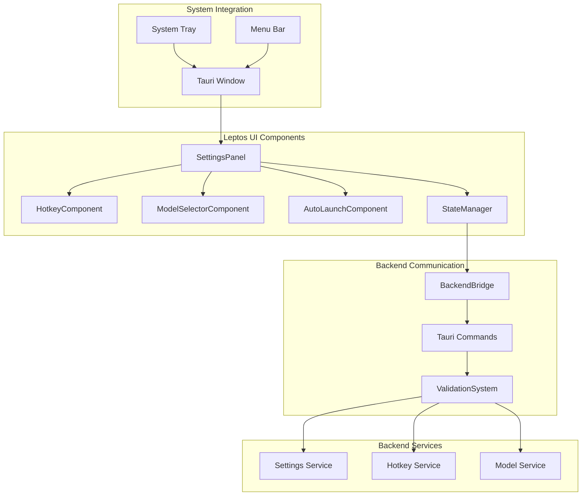

# Design Document

## Overview

The Settings UI feature provides a modern, responsive graphical interface for application
configuration using Leptos compiled to WebAssembly and embedded in a Tauri window. The interface
offers real-time validation, immediate setting application, and seamless integration with backend
services. The design emphasizes user experience, performance, and maintainability while leveraging
the existing settings persistence and validation infrastructure.

## Architecture

The settings UI follows a component-based architecture with clear separation between presentation,
state management, and backend communication:

- **SettingsPanel**: Main Leptos component orchestrating the settings interface
- **SettingsComponents**: Individual UI components for different setting categories
- **StateManager**: Reactive state management for settings data and UI state
- **BackendBridge**: Tauri command integration for backend communication
- **ValidationSystem**: Real-time validation with user feedback
- **TrayIntegration**: System tray integration for settings window access

### Component Interaction



## Components and Interfaces

### SettingsPanel (Main Component)

**Location**: `speakr-ui/src/settings.rs`

**Responsibilities**:

- Orchestrate the overall settings interface layout
- Manage component lifecycle and state synchronization
- Handle window events and user interactions
- Coordinate backend communication and error handling

**Key Structure**:

```rust
#[component]
pub fn SettingsPanel() -> impl IntoView {
    let (settings, set_settings) = create_signal(AppSettings::default());
    let (loading, set_loading) = create_signal(true);
    let (errors, set_errors) = create_signal(HashMap::<String, String>::new());

    // Load settings on component mount
    create_effect(move |_| {
        spawn_local(async move {
            match load_settings_from_backend().await {
                Ok(loaded_settings) => {
                    set_settings(loaded_settings);
                    set_loading(false);
                },
                Err(e) => {
                    set_error("load", &e.to_string());
                    set_loading(false);
                }
            }
        });
    });

    view! {
        <div class="settings-panel">
            <HotkeySection settings=settings set_settings=set_settings errors=errors />
            <ModelSection settings=settings set_settings=set_settings errors=errors />
            <AutoLaunchSection settings=settings set_settings=set_settings errors=errors />
        </div>
    }
}
```

### HotkeyComponent

**Location**: `speakr-ui/src/components/hotkey.rs`

**Responsibilities**:

- Provide hotkey input and validation interface
- Handle real-time hotkey validation
- Manage hotkey registration and conflict detection
- Display validation errors and suggestions

**Key Features**:

```rust
#[component]
pub fn HotkeySection(
    settings: ReadSignal<AppSettings>,
    set_settings: WriteSignal<AppSettings>,
    errors: ReadSignal<HashMap<String, String>>,
) -> impl IntoView {
    let (hotkey_input, set_hotkey_input) = create_signal(String::new());
    let (validating, set_validating) = create_signal(false);

    // Real-time validation with debouncing
    create_effect(move |_| {
        let input = hotkey_input.get();
        if !input.is_empty() {
            set_validating(true);
            spawn_local(async move {
                match validate_hotkey(&input).await {
                    Ok(_) => clear_error("hotkey"),
                    Err(e) => set_error("hotkey", &e.to_string()),
                }
                set_validating(false);
            });
        }
    });

    view! {
        <div class="hotkey-section">
            <label>"Global Hotkey"</label>
            <input
                type="text"
                value=move || hotkey_input.get()
                on:input=move |ev| set_hotkey_input(event_target_value(&ev))
                placeholder="e.g., CmdOrCtrl+Alt+Space"
            />
            <ValidationIndicator validating=validating errors=errors field="hotkey" />
        </div>
    }
}
```

### ModelSelectorComponent

**Location**: `speakr-ui/src/components/model.rs`

**Responsibilities**:

- Display available Whisper model options
- Check model availability and display status
- Handle model selection and validation
- Provide download suggestions for missing models

**Key Features**:

```rust
#[component]
pub fn ModelSection(
    settings: ReadSignal<AppSettings>,
    set_settings: WriteSignal<AppSettings>,
    errors: ReadSignal<HashMap<String, String>>,
) -> impl IntoView {
    let (model_availability, set_model_availability) = create_signal(HashMap::<ModelSize, bool>::new());

    // Check model availability on mount
    create_effect(move |_| {
        spawn_local(async move {
            for model_size in [ModelSize::Small, ModelSize::Medium, ModelSize::Large] {
                match check_model_availability(model_size).await {
                    Ok(available) => {
                        set_model_availability.update(|map| {
                            map.insert(model_size, available);
                        });
                    },
                    Err(_) => {
                        set_model_availability.update(|map| {
                            map.insert(model_size, false);
                        });
                    }
                }
            }
        });
    });

    view! {
        <div class="model-section">
            <label>"Whisper Model Size"</label>
            <For
                each=move || [ModelSize::Small, ModelSize::Medium, ModelSize::Large]
                key=|model| *model
                children=move |model| {
                    let available = model_availability.get().get(&model).copied().unwrap_or(false);
                    view! {
                        <ModelOption
                            model=model
                            available=available
                            selected=move || settings.get().model_size == model.to_string()
                            on_select=move |_| select_model(model, set_settings)
                        />
                    }
                }
            />
        </div>
    }
}
```

## Data Models

### UI State Management

```rust
#[derive(Debug, Clone)]
pub struct SettingsUIState {
    pub settings: AppSettings,
    pub loading: bool,
    pub saving: bool,
    pub errors: HashMap<String, String>,
    pub model_availability: HashMap<ModelSize, bool>,
    pub validation_state: HashMap<String, ValidationState>,
}

#[derive(Debug, Clone, PartialEq)]
pub enum ValidationState {
    Idle,
    Validating,
    Valid,
    Invalid(String),
}
```

### Backend Communication Types

```rust
#[derive(Debug, Clone, Serialize, Deserialize)]
pub struct SettingsUpdateRequest {
    pub field: String,
    pub value: serde_json::Value,
    pub validate_only: bool,
}

#[derive(Debug, Clone, Serialize, Deserialize)]
pub struct ValidationResponse {
    pub valid: bool,
    pub error: Option<String>,
    pub suggestions: Vec<String>,
}
```

## Error Handling

### Validation Error Display

```rust
#[component]
pub fn ValidationIndicator(
    validating: ReadSignal<bool>,
    errors: ReadSignal<HashMap<String, String>>,
    field: &'static str,
) -> impl IntoView {
    view! {
        <div class="validation-indicator">
            {move || {
                if validating.get() {
                    view! { <span class="validating">"Validating..."</span> }.into_view()
                } else if let Some(error) = errors.get().get(field) {
                    view! { <span class="error">{error}</span> }.into_view()
                } else {
                    view! { <span class="valid">"✓"</span> }.into_view()
                }
            }}
        </div>
    }
}
```

### Backend Error Handling

```rust
pub async fn handle_backend_error(error: TauriError) -> String {
    match error {
        TauriError::Settings(msg) => format!("Settings error: {}", msg),
        TauriError::Hotkey(msg) => format!("Hotkey error: {}", msg),
        TauriError::Model(msg) => format!("Model error: {}", msg),
        TauriError::Permission(msg) => format!("Permission required: {}", msg),
        _ => "An unexpected error occurred".to_string(),
    }
}
```

## Performance Optimization

### Lazy Loading and Code Splitting

```rust
// Lazy load heavy components
#[component]
pub fn AdvancedSettings() -> impl IntoView {
    let (show_advanced, set_show_advanced) = create_signal(false);

    view! {
        <div class="advanced-settings">
            <button on:click=move |_| set_show_advanced(!show_advanced.get())>
                "Advanced Settings"
            </button>
            {move || {
                if show_advanced.get() {
                    view! { <AdvancedSettingsPanel /> }.into_view()
                } else {
                    view! {}.into_view()
                }
            }}
        </div>
    }
}
```

### Debounced Validation

```rust
pub fn create_debounced_validator<T>(
    input: ReadSignal<T>,
    validator: impl Fn(T) -> BoxFuture<'static, Result<(), String>> + 'static,
    delay_ms: u64,
) -> ReadSignal<ValidationState>
where
    T: Clone + PartialEq + 'static,
{
    let (validation_state, set_validation_state) = create_signal(ValidationState::Idle);

    create_effect(move |_| {
        let value = input.get();
        set_validation_state(ValidationState::Validating);

        spawn_local(async move {
            // Debounce validation
            gloo_timers::future::TimeoutFuture::new(delay_ms as u32).await;

            match validator(value).await {
                Ok(_) => set_validation_state(ValidationState::Valid),
                Err(e) => set_validation_state(ValidationState::Invalid(e)),
            }
        });
    });

    validation_state
}
```

## Integration Points

### Tauri Command Integration

```rust
// Backend command wrappers
#[wasm_bindgen]
extern "C" {
    #[wasm_bindgen(js_namespace = ["window", "__TAURI__", "core"])]
    async fn invoke(cmd: &str, args: JsValue) -> JsValue;
}

pub async fn load_settings_from_backend() -> Result<AppSettings, TauriError> {
    let result = invoke("load_settings", JsValue::NULL).await;
    serde_wasm_bindgen::from_value(result)
        .map_err(|e| TauriError::Serialization(e.to_string()))
}

pub async fn save_settings_to_backend(settings: &AppSettings) -> Result<(), TauriError> {
    let args = serde_wasm_bindgen::to_value(settings)
        .map_err(|e| TauriError::Serialization(e.to_string()))?;

    let result = invoke("save_settings", args).await;
    serde_wasm_bindgen::from_value(result)
        .map_err(|e| TauriError::Serialization(e.to_string()))
}
```

### System Tray Integration

```rust
// In speakr-tauri/src/lib.rs
use tauri::{SystemTray, SystemTrayMenu, SystemTrayMenuItem, SystemTrayEvent};

pub fn create_system_tray() -> SystemTray {
    let tray_menu = SystemTrayMenu::new()
        .add_item(SystemTrayMenuItem::new("Settings", "settings"))
        .add_native_item(SystemTrayMenuItem::Separator)
        .add_item(SystemTrayMenuItem::new("Quit", "quit"));

    SystemTray::new().with_menu(tray_menu)
}

pub fn handle_system_tray_event(app: &AppHandle, event: SystemTrayEvent) {
    match event {
        SystemTrayEvent::MenuItemClick { id, .. } => {
            match id.as_str() {
                "settings" => {
                    if let Some(window) = app.get_window("settings") {
                        let _ = window.show();
                        let _ = window.set_focus();
                    } else {
                        create_settings_window(app);
                    }
                },
                "quit" => {
                    app.exit(0);
                },
                _ => {}
            }
        },
        _ => {}
    }
}
```

## Testing Strategy

### Component Testing

```rust
#[cfg(test)]
mod tests {
    use super::*;
    use leptos::*;

    #[test]
    fn test_hotkey_component_renders() {
        let settings = create_signal(AppSettings::default()).0;
        let set_settings = create_signal(AppSettings::default()).1;
        let errors = create_signal(HashMap::new()).0;

        let component = HotkeySection {
            settings,
            set_settings,
            errors,
        };

        // Test component creation and basic rendering
        assert!(component.into_view().is_some());
    }

    #[tokio::test]
    async fn test_settings_validation() {
        let invalid_hotkey = "InvalidHotkey";
        let result = validate_hotkey(invalid_hotkey).await;
        assert!(result.is_err());

        let valid_hotkey = "CmdOrCtrl+Alt+Space";
        let result = validate_hotkey(valid_hotkey).await;
        assert!(result.is_ok());
    }
}
```

### Integration Testing

```rust
#[cfg(test)]
mod integration_tests {
    use super::*;

    #[tokio::test]
    async fn test_settings_persistence() {
        let mut settings = AppSettings::default();
        settings.hot_key = "CmdOrCtrl+Alt+T".to_string();

        // Save settings
        save_settings_to_backend(&settings).await.unwrap();

        // Load settings
        let loaded = load_settings_from_backend().await.unwrap();
        assert_eq!(loaded.hot_key, settings.hot_key);
    }

    #[tokio::test]
    async fn test_model_availability_check() {
        let availability = check_model_availability(ModelSize::Small).await;
        assert!(availability.is_ok());
    }
}
```

### Performance Testing

```rust
#[cfg(test)]
mod performance_tests {
    use super::*;
    use std::time::Instant;

    #[tokio::test]
    async fn test_settings_window_startup_time() {
        let start = Instant::now();

        // Simulate settings window creation
        let settings = load_settings_from_backend().await.unwrap();
        let _component = SettingsPanel();

        let duration = start.elapsed();
        assert!(duration.as_millis() < 200, "Settings window should open within 200ms");
    }
}
```
