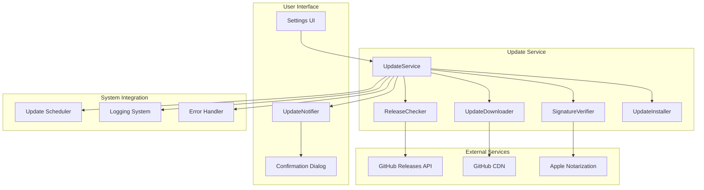

# Design Document

## Overview

The Auto-update feature provides optional automatic application updates via GitHub Releases with
secure download and verification. The system runs background checks for new versions while
maintaining user control over the update process. The design emphasizes security, reliability, and
seamless integration with the existing Speakr architecture while being completely optional and
gracefully degradable.

## Architecture

The auto-update system follows a service-oriented architecture with clear separation between update
checking, downloading, verification, and installation:

- **UpdateService**: Core service managing the update lifecycle
- **ReleaseChecker**: Monitors GitHub Releases for new versions
- **UpdateDownloader**: Handles secure download of update packages
- **SignatureVerifier**: Verifies code signatures and notarization
- **UpdateInstaller**: Manages the installation process
- **UpdateNotifier**: Provides user notifications and confirmations

### Component Interaction



## Components and Interfaces

### UpdateService

**Location**: `speakr-core/src/update/service.rs`

**Responsibilities**:

- Coordinate the complete update lifecycle
- Manage update scheduling and timing
- Integrate with settings for user preferences
- Provide status updates and error handling

**Key Methods**:

```rust
impl UpdateService {
    pub async fn new(config: UpdateConfig) -> Result<Self, UpdateError>
    pub async fn check_for_updates(&self) -> Result<Option<UpdateInfo>, UpdateError>
    pub async fn download_update(&self, update_info: UpdateInfo) -> Result<UpdatePackage, UpdateError>
    pub async fn install_update(&self, package: UpdatePackage) -> Result<(), UpdateError>
    pub fn is_enabled(&self) -> bool
    pub async fn set_enabled(&mut self, enabled: bool) -> Result<(), UpdateError>
}
```

### ReleaseChecker

**Location**: `speakr-core/src/update/checker.rs`

**Responsibilities**:

- Query GitHub Releases API for new versions
- Parse release information and metadata
- Compare versions to determine if updates are available
- Handle API rate limiting and network errors

**Key Methods**:

```rust
impl ReleaseChecker {
    pub fn new(repo_owner: String, repo_name: String) -> Self
    pub async fn get_latest_release(&self) -> Result<ReleaseInfo, CheckerError>
    pub async fn get_release_notes(&self, version: &str) -> Result<String, CheckerError>
    pub fn compare_versions(&self, current: &str, latest: &str) -> VersionComparison
}
```

### UpdateDownloader

**Location**: `speakr-core/src/update/downloader.rs`

**Responsibilities**:

- Download update packages securely via HTTPS
- Verify download integrity using checksums
- Provide download progress reporting
- Handle network failures and retries

**Key Methods**:

```rust
impl UpdateDownloader {
    pub fn new() -> Self
    pub async fn download(&self, url: &str, target_path: &Path) -> Result<DownloadResult, DownloadError>
    pub async fn verify_checksum(&self, file_path: &Path, expected_hash: &str) -> Result<bool, DownloadError>
    pub fn set_progress_callback(&mut self, callback: Box<dyn Fn(DownloadProgress)>)
}
```

## Data Models

### UpdateError

```rust
#[derive(Debug, Error, Clone, PartialEq)]
pub enum UpdateError {
    #[error("Update check failed: {0}")]
    CheckFailed(String),

    #[error("Download failed: {0}")]
    DownloadFailed(String),

    #[error("Signature verification failed: {0}")]
    VerificationFailed(String),

    #[error("Installation failed: {0}")]
    InstallationFailed(String),

    #[error("Network error: {0}")]
    NetworkError(String),

    #[error("Update disabled by user")]
    UpdateDisabled,

    #[error("No update available")]
    NoUpdateAvailable,
}
```

### UpdateInfo

```rust
#[derive(Debug, Clone, PartialEq)]
pub struct UpdateInfo {
    pub version: String,
    pub release_notes: String,
    pub download_url: String,
    pub checksum: String,
    pub signature_url: Option<String>,
    pub published_at: SystemTime,
    pub is_prerelease: bool,
}
```

### UpdateConfig

```rust
#[derive(Debug, Clone, Serialize, Deserialize)]
pub struct UpdateConfig {
    pub enabled: bool,
    pub check_interval_hours: u64,
    pub auto_install: bool,
    pub include_prereleases: bool,
    pub repo_owner: String,
    pub repo_name: String,
}

impl Default for UpdateConfig {
    fn default() -> Self {
        Self {
            enabled: true,
            check_interval_hours: 24,
            auto_install: false,
            include_prereleases: false,
            repo_owner: "speakr-app".to_string(),
            repo_name: "speakr".to_string(),
        }
    }
}
```

### DownloadProgress

```rust
#[derive(Debug, Clone)]
pub struct DownloadProgress {
    pub bytes_downloaded: u64,
    pub total_bytes: Option<u64>,
    pub speed_bytes_per_sec: u64,
    pub eta_seconds: Option<u64>,
}
```

## Error Handling

### Network and API Failures

1. **GitHub API Rate Limiting**: When API requests are rate limited

   - Implement exponential backoff with jitter
   - Cache release information to reduce API calls
   - Gracefully handle rate limit responses

2. **Network Connectivity Issues**: When network is unavailable

   - Detect network connectivity before making requests
   - Fail gracefully without user notification for routine checks
   - Provide clear error messages for user-initiated checks

3. **API Response Parsing**: When GitHub API responses are malformed
   - Validate JSON responses before parsing
   - Handle missing or unexpected fields gracefully
   - Log parsing errors for debugging

### Download and Verification Failures

1. **Download Interruption**: When downloads are interrupted

   - Support resume for partial downloads
   - Verify partial downloads before resuming
   - Clean up incomplete downloads on failure

2. **Signature Verification**: When code signatures are invalid

   - Reject updates with invalid signatures immediately
   - Provide clear error messages about security failures
   - Log verification details for security auditing

3. **Disk Space Issues**: When insufficient space for downloads
   - Check available disk space before downloading
   - Clean up temporary files on space errors
   - Provide user guidance for freeing space

## Security Considerations

### Code Signature Verification

```rust
impl SignatureVerifier {
    pub async fn verify_macos_signature(&self, file_path: &Path) -> Result<bool, VerificationError> {
        // Use macOS codesign utility to verify signature
        let output = Command::new("codesign")
            .args(&["--verify", "--deep", "--strict"])
            .arg(file_path)
            .output()
            .await?;

        if output.status.success() {
            // Additional notarization check
            self.verify_notarization(file_path).await
        } else {
            Err(VerificationError::InvalidSignature(
                String::from_utf8_lossy(&output.stderr).to_string()
            ))
        }
    }

    async fn verify_notarization(&self, file_path: &Path) -> Result<bool, VerificationError> {
        let output = Command::new("spctl")
            .args(&["--assess", "--verbose", "--type", "execute"])
            .arg(file_path)
            .output()
            .await?;

        Ok(output.status.success())
    }
}
```

### Secure Download Practices

- Always use HTTPS for downloads
- Verify TLS certificates and reject invalid certificates
- Validate checksums for all downloaded files
- Store temporary files in secure locations with restricted permissions

## Performance Optimization

### Background Processing

```rust
impl UpdateService {
    pub async fn start_background_checker(&self) -> Result<(), UpdateError> {
        let config = self.config.clone();
        let checker = self.release_checker.clone();

        tokio::spawn(async move {
            let mut interval = tokio::time::interval(
                Duration::from_secs(config.check_interval_hours * 3600)
            );

            loop {
                interval.tick().await;

                if config.enabled {
                    match checker.check_for_updates().await {
                        Ok(Some(update)) => {
                            // Notify user of available update
                            Self::notify_update_available(update).await;
                        }
                        Ok(None) => {
                            // No update available, continue silently
                        }
                        Err(e) => {
                            // Log error but don't notify user for background checks
                            tracing::warn!("Background update check failed: {}", e);
                        }
                    }
                }
            }
        });

        Ok(())
    }
}
```

### Efficient API Usage

- Cache GitHub API responses to reduce requests
- Use conditional requests with ETags when available
- Implement intelligent retry logic with exponential backoff
- Batch multiple API calls when possible

## Integration Points

### Settings Integration

The update system integrates with the existing settings system:

```rust
// Extend AppSettings in speakr-types/src/lib.rs
impl AppSettings {
    pub fn get_update_config(&self) -> UpdateConfig {
        UpdateConfig {
            enabled: self.auto_update_enabled.unwrap_or(true),
            check_interval_hours: self.update_check_interval_hours.unwrap_or(24),
            auto_install: self.auto_install_updates.unwrap_or(false),
            include_prereleases: self.include_prerelease_updates.unwrap_or(false),
            repo_owner: "speakr-app".to_string(),
            repo_name: "speakr".to_string(),
        }
    }
}
```

### UI Integration

Update notifications integrate with the existing UI system:

```rust
pub async fn show_update_notification(
    app_handle: &AppHandle,
    update_info: UpdateInfo
) -> Result<UpdateDecision, UIError> {
    let notification_config = UpdateNotificationConfig {
        version: update_info.version,
        release_notes: update_info.release_notes,
        download_size: update_info.download_size,
    };

    app_handle.emit("show-update-notification", notification_config)?;

    // Wait for user decision
    let (tx, rx) = oneshot::channel();
    app_handle.once("update-decision", move |event| {
        if let Ok(decision) = serde_json::from_str(event.payload()) {
            let _ = tx.send(decision);
        }
    });

    rx.await.map_err(|_| UIError::UserCancelled)
}
```

### Status Reporting Integration

Update status is reported through the existing status system:

```rust
impl UpdateService {
    fn update_status(&self, status: UpdateStatus) {
        // Could extend BackendStatus to include update status
        // Or use existing notification system for update-specific status
        self.status_reporter.report_update_status(status);
    }
}
```

## Testing Strategy

### Unit Tests

1. **Version Comparison**: Test semantic version comparison logic
2. **API Response Parsing**: Test GitHub API response parsing with various inputs
3. **Signature Verification**: Test code signature verification with valid/invalid signatures
4. **Error Handling**: Test all error scenarios and recovery mechanisms

### Integration Tests

1. **GitHub API Integration**: Test actual API calls with rate limiting and error handling
2. **Download Process**: Test complete download workflow with progress reporting
3. **Settings Integration**: Test update configuration persistence and changes
4. **UI Integration**: Test update notification display and user interaction

### Security Tests

1. **Signature Verification**: Test with tampered binaries and invalid signatures
2. **HTTPS Validation**: Test certificate validation and secure connection handling
3. **Checksum Verification**: Test file integrity validation with corrupted downloads
4. **Privilege Escalation**: Test that updates don't require unnecessary permissions

### Performance Tests

1. **Background Processing**: Verify update checks don't impact main application performance
2. **Memory Usage**: Monitor memory consumption during download and installation
3. **Network Efficiency**: Test API usage patterns and bandwidth consumption
4. **Startup Impact**: Ensure update service doesn't slow application startup
