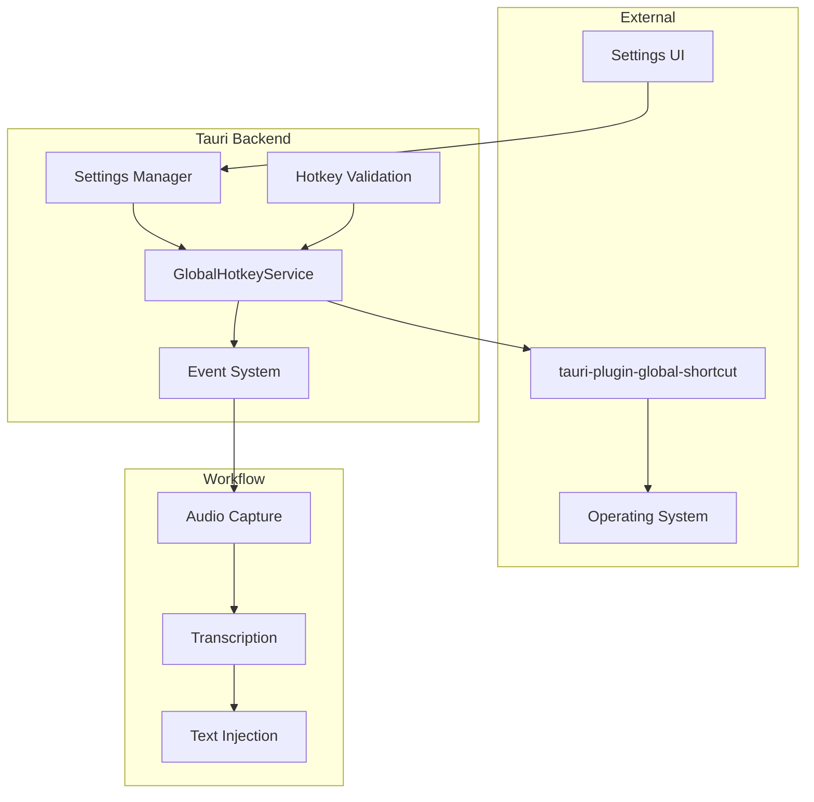

# Design Document

## Overview

The Global Hotkey feature provides system-wide keyboard shortcut registration and management for
triggering the Speakr dictation workflow. The design leverages Tauri's plugin ecosystem through
`tauri-plugin-global-shortcut` to achieve cross-platform hotkey registration while maintaining
a clean separation between hotkey management, settings persistence, and workflow orchestration.

## Architecture

The system follows a service-oriented architecture with clear separation of concerns:

- **GlobalHotkeyService**: Manages hotkey registration, conflict detection, and event emission
- **Settings Integration**: Persists user-configured hotkeys and handles runtime updates
- **Event System**: Uses Tauri's event system to decouple hotkey triggers from workflow execution
- **Validation Layer**: Provides input validation and conflict detection for hotkey configurations

### Component Interaction



## Components and Interfaces

### GlobalHotkeyService

**Location**: `speakr-tauri/src/services/hotkey.rs`

**Responsibilities**:

- Register and unregister global hotkeys with the operating system
- Handle hotkey conflicts with fallback strategies
- Emit Tauri events when hotkeys are triggered
- Maintain thread-safe state of active hotkey configuration

**Key Methods**:

```rust
impl GlobalHotkeyService {
    pub(crate) fn new(app_handle: AppHandle) -> Result<Self, HotkeyError>
    pub(crate) async fn register_hotkey(&mut self, config: &HotkeyConfig) -> Result<(), HotkeyError>
    pub(crate) async fn unregister_hotkey(&mut self) -> Result<(), HotkeyError>
}

// Helper functions for Tauri commands
pub async fn register_global_hotkey_internal(app_handle: AppHandle, config: HotkeyConfig) -> Result<(), String>
pub async fn unregister_global_hotkey_internal(app_handle: AppHandle) -> Result<(), String>
```

### HotkeyConfig Data Model

**Location**: `speakr-types/src/lib.rs`

**Structure**:

```rust
#[derive(Debug, Clone, Serialize, Deserialize, PartialEq)]
pub struct HotkeyConfig {
    /// The hotkey combination string in Tauri format (e.g., "CmdOrCtrl+Alt+Space")
    pub shortcut: String,
    /// Whether the hotkey is currently enabled
    pub enabled: bool,
}

impl Default for HotkeyConfig {
    fn default() -> Self {
        Self {
            shortcut: DEFAULT_HOTKEY.to_string(),
            enabled: true,
        }
    }
}
```

### Validation Interface

**Location**: `speakr-tauri/src/commands/validation.rs`

**Functions**:

```rust
pub(crate) fn validate_hot_key_internal(hotkey: &str) -> Result<(), String>
```

**Note**: The current implementation leverages Tauri's native shortcut parsing
(`shortcut.parse::<Shortcut>()`) for validation, which provides robust cross-platform hotkey format
validation.

## Data Models

### HotkeyError

```rust
#[derive(Error, Debug, Clone, Serialize, Deserialize, PartialEq)]
pub enum HotkeyError {
    /// Failed to register the hotkey with the system.
    #[error("Failed to register global hot-key: {0}")]
    RegistrationFailed(String),

    /// Hotkey conflicts with existing system or application shortcuts.
    #[error("Hot-key conflict detected: {0}")]
    ConflictDetected(String),

    /// Hotkey not found in the registry during operations.
    #[error("Hot-key not found: {0}")]
    NotFound(String),
}
```

### Event Payloads

**Current Implementation**:

```rust
// Simple event emission - no payload currently
app_handle.emit("hotkey-triggered", ());
```

**Future Enhancement**:

```rust
#[derive(Debug, Serialize)]
pub struct HotkeyTriggeredEvent {
    pub timestamp: SystemTime,
    pub hotkey: HotkeyConfig,
    pub sequence_id: Uuid,
}
```

## Error Handling

### Registration Failures

1. **Conflict Detection**: When a hotkey conflicts with system or application shortcuts
   - Try predefined fallback hotkeys in order of preference
   - Emit conflict warning events to UI
   - Log conflict details for debugging

2. **Platform Limitations**: When the platform doesn't support the requested hotkey
   - Gracefully degrade to supported alternatives
   - Provide clear error messages to users

3. **Permission Issues**: When the application lacks necessary permissions
   - Guide users through permission granting process
   - Provide fallback options where possible

### Runtime Error Recovery

**Current Implementation**:

- Conflicts are detected during registration and returned as `HotkeyError::ConflictDetected`
- The service automatically unregisters existing shortcuts before registering new ones
- Error handling is delegated to the calling code (Tauri commands)

**Future Enhancement**:

```rust
impl GlobalHotkeyService {
    fn handle_registration_error(&mut self, error: HotkeyError) -> Result<(), HotkeyError> {
        match error {
            HotkeyError::ConflictDetected(_) => {
                self.try_fallback_hotkeys()
            },
            _ => Err(error)
        }
    }
}
```

## Testing Strategy

### Unit Tests

1. **Hotkey Parsing**: Test various hotkey string formats and edge cases
2. **Conflict Detection**: Mock conflict scenarios and validate fallback behaviour
3. **Event Emission**: Verify correct event payloads and timing
4. **State Management**: Test thread-safe access to hotkey state

### Integration Tests

1. **Plugin Integration**: Test actual registration with `tauri-plugin-global-shortcut`
2. **Settings Persistence**: Verify hotkey configurations persist across restarts
3. **UI Integration**: Test settings UI updates and validation feedback

### Performance Tests

1. **Registration Speed**: Measure hotkey registration time (target: <100ms)
2. **Response Time**: Measure time from hotkey press to event emission
3. **Memory Usage**: Monitor service memory footprint during operation

### Cross-Platform Tests

1. **macOS**: Test with various modifier combinations and system shortcuts
2. **Windows**: Validate Windows-specific hotkey behaviors
3. **Linux**: Test across different desktop environments

## Implementation Phases

### Phase 1: Core Service Implementation

- Implement `GlobalHotkeyService` with basic registration
- Add hotkey validation and parsing
- Create unit tests for core functionality

### Phase 2: Settings Integration

- Connect service to settings persistence
- Implement runtime hotkey updates
- Add settings UI integration

### Phase 3: Workflow Integration

- Wire hotkey events to dictation pipeline
- Implement end-to-end workflow triggering
- Add performance monitoring

### Phase 4: Polish and Optimization

- Implement conflict detection and resolution
- Add comprehensive error handling
- Optimize performance and memory usage
