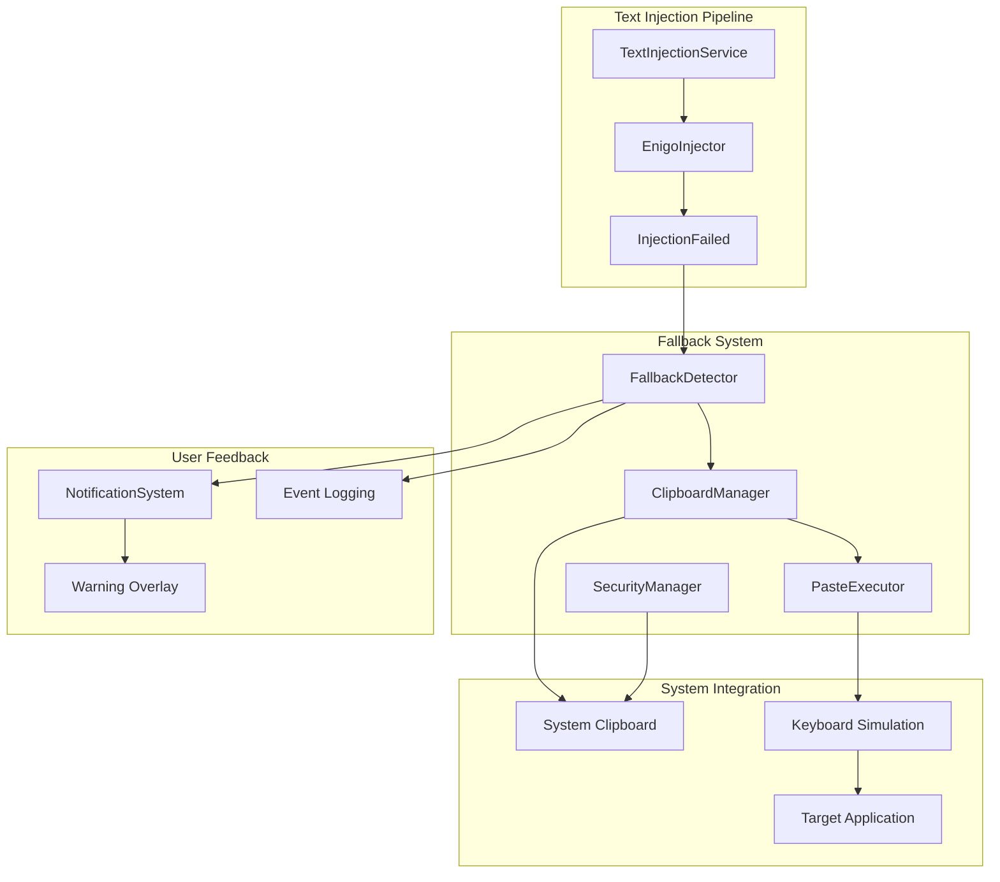

# Design Document

## Overview

The Injection Fallback feature provides a clipboard-based alternative when direct text injection
fails or is blocked by secure input fields. The system automatically detects injection failures and
seamlessly switches to clipboard paste operations while preserving user data and providing
appropriate feedback. The design emphasizes security, user experience, and reliable fallback
detection to ensure universal compatibility across all macOS applications.

## Architecture

The injection fallback system integrates with the existing text injection pipeline to provide
seamless fallback capabilities:

- **FallbackDetector**: Monitors injection operations and detects failure conditions
- **ClipboardManager**: Handles clipboard operations with proper data preservation
- **PasteExecutor**: Executes ⌘V paste commands using system APIs
- **NotificationSystem**: Provides user feedback when fallback is triggered
- **SecurityManager**: Ensures proper cleanup of sensitive data

### Component Interaction



## Components and Interfaces

### FallbackDetector

**Location**: `speakr-core/src/injection/fallback/detector.rs`

**Responsibilities**:

- Monitor text injection operations for failure conditions
- Detect secure text fields and accessibility restrictions
- Trigger fallback operations when injection fails
- Provide failure analysis and logging

**Key Methods**:

```rust
impl FallbackDetector {
    pub fn new() -> Self
    pub async fn monitor_injection(&self, injection_future: impl Future<Output = Result<InjectionResult, InjectionError>>) -> FallbackResult
    pub fn is_secure_field_error(&self, error: &InjectionError) -> bool
    pub fn should_trigger_fallback(&self, error: &InjectionError) -> bool
}
```

### ClipboardManager

**Location**: `speakr-core/src/injection/fallback/clipboard.rs`

**Responsibilities**:

- Save and restore clipboard contents
- Copy transcript text to clipboard
- Manage clipboard data lifecycle and cleanup
- Handle clipboard access permissions

**Key Methods**:

```rust
impl ClipboardManager {
    pub fn new() -> Result<Self, ClipboardError>
    pub async fn save_current_clipboard(&self) -> Result<ClipboardBackup, ClipboardError>
    pub async fn copy_text(&self, text: &str) -> Result<(), ClipboardError>
    pub async fn restore_clipboard(&self, backup: ClipboardBackup) -> Result<(), ClipboardError>
    pub async fn clear_clipboard(&self) -> Result<(), ClipboardError>
}
```

### PasteExecutor

**Location**: `speakr-core/src/injection/fallback/paste.rs`

**Responsibilities**:

- Execute ⌘V paste commands
- Handle paste operation timing and verification
- Provide paste success/failure feedback
- Integrate with macOS keyboard simulation APIs

**Key Methods**:

```rust
impl PasteExecutor {
    pub fn new() -> Result<Self, PasteError>
    pub async fn execute_paste(&self) -> Result<PasteResult, PasteError>
    pub async fn verify_paste_success(&self) -> Result<bool, PasteError>
    pub fn set_paste_delay(&mut self, delay: Duration)
}
```

## Data Models

### FallbackResult

```rust
#[derive(Debug, Clone, PartialEq)]
pub enum FallbackResult {
    NotNeeded(InjectionResult),
    Success(FallbackSuccess),
    Failed(FallbackError),
}

#[derive(Debug, Clone, PartialEq)]
pub struct FallbackSuccess {
    pub original_error: InjectionError,
    pub text_pasted: String,
    pub paste_time: Duration,
    pub clipboard_restored: bool,
}
```

### ClipboardBackup

```rust
#[derive(Debug, Clone)]
pub struct ClipboardBackup {
    pub content: ClipboardContent,
    pub timestamp: SystemTime,
    pub format: ClipboardFormat,
}

#[derive(Debug, Clone)]
pub enum ClipboardContent {
    Text(String),
    Image(Vec<u8>),
    Files(Vec<PathBuf>),
    Empty,
}

#[derive(Debug, Clone, PartialEq)]
pub enum ClipboardFormat {
    PlainText,
    RichText,
    Image,
    Files,
    Unknown,
}
```

### FallbackError

```rust
#[derive(Debug, Error, Clone, PartialEq)]
pub enum FallbackError {
    #[error("Clipboard access denied")]
    ClipboardAccessDenied,

    #[error("Failed to save clipboard: {0}")]
    ClipboardSaveFailed(String),

    #[error("Failed to restore clipboard: {0}")]
    ClipboardRestoreFailed(String),

    #[error("Paste operation failed: {0}")]
    PasteFailed(String),

    #[error("Paste verification timeout")]
    PasteVerificationTimeout,

    #[error("Security cleanup failed: {0}")]
    SecurityCleanupFailed(String),
}
```

## Error Handling

### Injection Failure Detection

1. **Enigo Errors**: Direct errors from the enigo crate

   - Detect permission denied errors
   - Handle device access failures
   - Identify secure field restrictions

2. **Timeout Detection**: When injection takes too long

   - Monitor injection operation duration
   - Trigger fallback after configurable timeout
   - Log timeout conditions for analysis

3. **Accessibility Restrictions**: When system blocks synthetic input
   - Detect accessibility permission issues
   - Handle system security policy blocks
   - Provide appropriate user guidance

### Clipboard Operation Failures

1. **Clipboard Access Issues**: When clipboard cannot be accessed

   - Handle permission denied errors
   - Provide fallback error messages
   - Log clipboard access failures

2. **Clipboard Restoration Failures**: When original content cannot be restored
   - Attempt multiple restoration strategies
   - Log restoration failures for debugging
   - Provide user notification of data loss risk

### Paste Operation Failures

1. **Paste Command Failures**: When ⌘V simulation fails

   - Retry paste operation with different timing
   - Detect application-specific paste issues
   - Provide alternative paste methods

2. **Paste Verification Failures**: When paste success cannot be confirmed
   - Implement timeout-based verification
   - Use heuristic methods to detect paste success
   - Provide user feedback on uncertain outcomes

## Security Considerations

### Sensitive Data Handling

```rust
impl SecurityManager {
    pub async fn secure_clipboard_operation<T>(
        &self,
        operation: impl FnOnce() -> Result<T, ClipboardError>
    ) -> Result<T, ClipboardError> {
        // Save current clipboard
        let backup = self.clipboard.save_current_clipboard().await?;

        // Perform operation
        let result = operation();

        // Always restore clipboard, even on error
        if let Err(e) = self.clipboard.restore_clipboard(backup).await {
            error!("Failed to restore clipboard after secure operation: {}", e);
        }

        // Clear any sensitive data
        self.clipboard.clear_clipboard().await?;

        result
    }
}
```

### Data Lifecycle Management

1. **Minimal Clipboard Exposure**: Keep sensitive data on clipboard for shortest possible time
2. **Automatic Cleanup**: Ensure cleanup occurs even when operations fail
3. **Secure Logging**: Avoid logging sensitive transcript content
4. **Memory Management**: Clear sensitive data from memory after use

## Performance Optimization

### Clipboard Operation Timing

```rust
impl ClipboardManager {
    async fn optimized_clipboard_cycle(&self, text: &str) -> Result<(), ClipboardError> {
        // Save current clipboard (fast operation)
        let backup = self.save_current_clipboard().await?;

        // Copy text (minimize time on clipboard)
        self.copy_text(text).await?;

        // Execute paste immediately
        self.paste_executor.execute_paste().await?;

        // Restore original clipboard quickly
        tokio::time::timeout(
            Duration::from_millis(500),
            self.restore_clipboard(backup)
        ).await??;

        Ok(())
    }
}
```

### Fallback Detection Optimization

- **Early Detection**: Identify secure fields before attempting injection
- **Cached Results**: Remember applications that require fallback
- **Heuristic Improvements**: Learn from successful/failed injection patterns

## Integration Points

### Text Injection Service Integration

The fallback system integrates seamlessly with the existing text injection service:

```rust
impl TextInjectionService {
    pub async fn inject_with_fallback(&self, text: String) -> Result<InjectionResult, InjectionError> {
        // Attempt normal injection first
        match self.inject_text_direct(text.clone()).await {
            Ok(result) => Ok(result),
            Err(injection_error) => {
                // Check if fallback should be triggered
                if self.fallback_detector.should_trigger_fallback(&injection_error) {
                    info!("Injection failed, attempting clipboard fallback");
                    self.execute_fallback(text, injection_error).await
                } else {
                    Err(injection_error)
                }
            }
        }
    }
}
```

### Notification System Integration

Fallback operations trigger user notifications through the existing notification system:

```rust
pub async fn notify_fallback_used(
    notification_service: &NotificationService,
    fallback_reason: &str,
) -> Result<(), NotificationError> {
    let message = "Secure field detected – text pasted via clipboard";

    notification_service.show_overlay(OverlayConfig {
        message: message.to_string(),
        duration: Duration::from_secs(3),
        level: NotificationLevel::Warning,
        auto_dismiss: true,
    }).await
}
```

### Settings Integration

Fallback behavior can be configured through application settings:

```rust
#[derive(Debug, Clone, Serialize, Deserialize)]
pub struct FallbackSettings {
    pub enable_clipboard_fallback: bool,
    pub fallback_timeout_ms: u64,
    pub show_fallback_notifications: bool,
    pub clipboard_restore_timeout_ms: u64,
}

impl Default for FallbackSettings {
    fn default() -> Self {
        Self {
            enable_clipboard_fallback: true,
            fallback_timeout_ms: 2000,
            show_fallback_notifications: true,
            clipboard_restore_timeout_ms: 500,
        }
    }
}
```

## Testing Strategy

### Unit Tests

1. **Fallback Detection**: Test various injection failure scenarios
2. **Clipboard Operations**: Test save, copy, paste, and restore operations
3. **Security Cleanup**: Test proper cleanup under various failure conditions
4. **Timing Requirements**: Test clipboard restoration within 500ms

### Integration Tests

1. **Secure Field Testing**: Test with Safari password fields and other secure inputs
2. **Application Compatibility**: Test fallback across different macOS applications
3. **Clipboard Preservation**: Test that user clipboard data is properly preserved
4. **Notification Display**: Test overlay appearance and auto-dismissal

### Security Tests

1. **Data Cleanup**: Verify no sensitive data remains on clipboard after operations
2. **Error Handling**: Test cleanup occurs even when operations fail
3. **Memory Security**: Verify sensitive data is cleared from memory
4. **Permission Handling**: Test behavior when clipboard access is denied

### Performance Tests

1. **Fallback Speed**: Measure total fallback operation time
2. **Clipboard Restoration**: Verify 500ms restoration requirement
3. **Memory Usage**: Monitor memory consumption during fallback operations
4. **Success Rate**: Verify 100% success rate in secure fields
