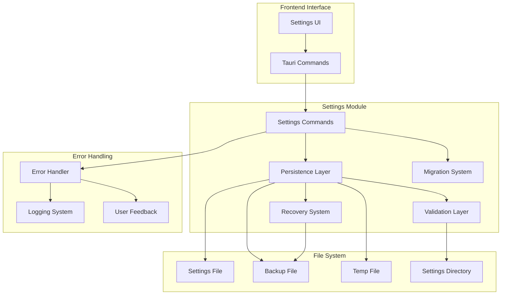

# Design Document

## Overview

The Settings Persistence feature provides robust local storage of user preferences using JSON files
with atomic writes, corruption recovery, and schema migration capabilities. Built around the
existing implementation in `speakr-tauri/src/settings/`, the system ensures data integrity through
backup mechanisms, provides fast access to settings, and maintains complete offline operation. The
design emphasizes reliability, performance, and future extensibility.

## Architecture

The settings persistence system follows a layered architecture with clear separation between API,
business logic, and file operations:

- **Settings Commands**: Tauri command interface for frontend integration
- **Persistence Layer**: Core file I/O operations with atomic writes
- **Migration System**: Schema versioning and automatic migration
- **Validation Layer**: Settings validation and directory permission checking
- **Recovery System**: Corruption detection and backup restoration
- **Error Handling**: Comprehensive error management and user feedback

### Component Interaction



## Components and Interfaces

### Settings Commands

**Location**: `speakr-tauri/src/settings/commands.rs`

**Responsibilities**:

- Provide Tauri command interface for settings operations
- Coordinate between frontend requests and persistence layer
- Handle command-level error processing and logging
- Manage settings directory resolution

**Key Methods**:

```rust
impl SettingsCommands {
    pub async fn save_settings_internal(settings: AppSettings) -> Result<(), AppError>
    pub async fn load_settings_internal() -> Result<AppSettings, AppError>
}
```

### Persistence Layer

**Location**: `speakr-tauri/src/settings/persistence.rs`

**Responsibilities**:

- Handle atomic file operations for settings storage
- Manage settings file paths and directory creation
- Implement backup and recovery mechanisms
- Provide low-level file I/O with error handling

**Key Methods**:

```rust
impl PersistenceLayer {
    pub fn get_settings_path() -> Result<PathBuf, AppError>
    pub fn get_settings_backup_path() -> Result<PathBuf, AppError>
    pub async fn save_settings_to_dir(settings: &AppSettings, dir: &PathBuf) -> Result<(), AppError>
    pub async fn load_settings_from_dir(dir: &PathBuf) -> Result<AppSettings, AppError>
    pub fn try_load_settings_file(path: &PathBuf) -> Result<AppSettings, String>
}
```

### Migration System

**Location**: `speakr-tauri/src/settings/migration.rs`

**Responsibilities**:

- Handle schema version detection and migration
- Provide migration strategies for different version transitions
- Backup original settings before migration
- Validate migrated settings for correctness

**Key Methods**:

```rust
impl MigrationSystem {
    pub fn migrate_settings(settings: &mut AppSettings) -> Result<bool, AppError>
    pub fn get_current_schema_version() -> u32
    pub fn needs_migration(settings: &AppSettings) -> bool
    pub fn backup_before_migration(settings: &AppSettings) -> Result<(), AppError>
}
```

## Data Models

### Settings File Structure

```json
{
  "version": 1,
  "hot_key": "CmdOrCtrl+Alt+F1",
  "model_size": "medium",
  "auto_launch": false,
  "transcription_language": "en",
  "created_at": "2025-01-15T10:30:00Z",
  "updated_at": "2025-01-15T10:30:00Z"
}
```

### AppSettings Structure

```rust
#[derive(Debug, Clone, Serialize, Deserialize, PartialEq)]
pub struct AppSettings {
    pub version: u32,
    pub hot_key: String,
    pub model_size: String,
    pub auto_launch: bool,
    pub transcription_language: String,
    pub created_at: Option<DateTime<Utc>>,
    pub updated_at: Option<DateTime<Utc>>,
}

impl Default for AppSettings {
    fn default() -> Self {
        Self {
            version: 1,
            hot_key: DEFAULT_HOTKEY.to_string(),
            model_size: DEFAULT_MODEL_SIZE.to_string(),
            auto_launch: false,
            transcription_language: "en".to_string(),
            created_at: Some(Utc::now()),
            updated_at: Some(Utc::now()),
        }
    }
}
```

### Error Types

```rust
#[derive(Debug, Error, Clone, PartialEq)]
pub enum SettingsError {
    #[error("Settings file not found: {path}")]
    FileNotFound { path: String },

    #[error("Settings file corrupted: {reason}")]
    FileCorrupted { reason: String },

    #[error("Permission denied accessing settings directory: {path}")]
    PermissionDenied { path: String },

    #[error("JSON parsing failed: {error}")]
    JsonParsingFailed { error: String },

    #[error("Migration failed from version {from} to {to}: {reason}")]
    MigrationFailed { from: u32, to: u32, reason: String },

    #[error("Backup creation failed: {reason}")]
    BackupFailed { reason: String },
}
```

## File Operations

### Atomic Write Implementation

```rust
impl PersistenceLayer {
    pub async fn save_settings_to_dir(
        settings: &AppSettings,
        settings_dir: &PathBuf,
    ) -> Result<(), AppError> {
        // Ensure directory exists
        tokio::fs::create_dir_all(settings_dir).await?;

        let settings_path = settings_dir.join("settings.json");
        let backup_path = settings_dir.join("settings.json.backup");
        let temp_path = settings_path.with_extension("json.tmp");

        // Update timestamps
        let mut settings_to_save = settings.clone();
        settings_to_save.version = CURRENT_SCHEMA_VERSION;
        settings_to_save.updated_at = Some(Utc::now());

        // Serialize to JSON
        let json_content = serde_json::to_string_pretty(&settings_to_save)
            .map_err(|e| AppError::Settings(format!("JSON serialization failed: {}", e)))?;

        // Create backup of existing settings
        if settings_path.exists() {
            tokio::fs::copy(&settings_path, &backup_path).await
                .map_err(|e| AppError::Settings(format!("Backup creation failed: {}", e)))?;
        }

        // Atomic write: write to temp file, then rename
        tokio::fs::write(&temp_path, json_content).await
            .map_err(|e| AppError::Settings(format!("Failed to write temp file: {}", e)))?;

        tokio::fs::rename(&temp_path, &settings_path).await
            .map_err(|e| AppError::Settings(format!("Failed to rename temp file: {}", e)))?;

        Ok(())
    }
}
```

### Corruption Recovery

```rust
impl RecoverySystem {
    pub async fn load_settings_from_dir(settings_dir: &PathBuf) -> Result<AppSettings, AppError> {
        let settings_path = settings_dir.join("settings.json");
        let backup_path = settings_dir.join("settings.json.backup");

        // Try to load main settings file
        match Self::try_load_settings_file(&settings_path) {
            Ok(settings) => {
                // Check if migration is needed
                let mut settings = settings;
                if migrate_settings(&mut settings)? {
                    // Save migrated settings
                    save_settings_to_dir(&settings, settings_dir).await?;
                }
                Ok(settings)
            },
            Err(main_error) => {
                warn!("Failed to load main settings file: {}", main_error);

                // Try to load backup
                match Self::try_load_settings_file(&backup_path) {
                    Ok(backup_settings) => {
                        warn!("Recovered settings from backup");

                        // Save recovered settings as main file
                        save_settings_to_dir(&backup_settings, settings_dir).await?;
                        Ok(backup_settings)
                    },
                    Err(backup_error) => {
                        error!("Both main and backup settings failed to load");
                        error!("Main error: {}", main_error);
                        error!("Backup error: {}", backup_error);

                        // Fall back to defaults
                        let default_settings = AppSettings::default();
                        save_settings_to_dir(&default_settings, settings_dir).await?;

                        Ok(default_settings)
                    }
                }
            }
        }
    }
}
```

## Migration Framework

### Version Detection and Migration

```rust
impl MigrationSystem {
    pub fn migrate_settings(settings: &mut AppSettings) -> Result<bool, AppError> {
        let current_version = Self::get_current_schema_version();

        if settings.version >= current_version {
            return Ok(false); // No migration needed
        }

        info!("Migrating settings from version {} to {}", settings.version, current_version);

        // Backup before migration
        Self::backup_before_migration(settings)?;

        // Apply migrations in sequence
        let mut migrated = false;

        while settings.version < current_version {
            match settings.version {
                0 => {
                    Self::migrate_v0_to_v1(settings)?;
                    migrated = true;
                },
                1 => {
                    // Future migration: v1 to v2
                    // Self::migrate_v1_to_v2(settings)?;
                    break; // No migration available yet
                },
                _ => {
                    return Err(AppError::Settings(format!(
                        "Unknown settings version: {}", settings.version
                    )));
                }
            }
        }

        if migrated {
            settings.updated_at = Some(Utc::now());
            info!("Settings migration completed successfully");
        }

        Ok(migrated)
    }

    fn migrate_v0_to_v1(settings: &mut AppSettings) -> Result<(), AppError> {
        // Example migration: add new fields with defaults
        if settings.transcription_language.is_empty() {
            settings.transcription_language = "en".to_string();
        }

        settings.version = 1;
        Ok(())
    }
}
```

## Performance Optimization

### Caching and Batching

```rust
pub struct SettingsCache {
    cached_settings: Arc<RwLock<Option<AppSettings>>>,
    last_modified: Arc<RwLock<Option<SystemTime>>>,
    pending_saves: Arc<Mutex<Option<AppSettings>>>,
    save_debouncer: Arc<Mutex<Option<tokio::task::JoinHandle<()>>>>,
}

impl SettingsCache {
    pub async fn get_settings(&self) -> Result<AppSettings, AppError> {
        // Check cache first
        if let Some(cached) = self.cached_settings.read().await.as_ref() {
            return Ok(cached.clone());
        }

        // Load from disk and cache
        let settings = load_settings_internal().await?;
        *self.cached_settings.write().await = Some(settings.clone());

        Ok(settings)
    }

    pub async fn save_settings_debounced(&self, settings: AppSettings) -> Result<(), AppError> {
        // Update cache immediately
        *self.cached_settings.write().await = Some(settings.clone());

        // Debounce disk writes
        *self.pending_saves.lock().await = Some(settings);

        let pending_saves = self.pending_saves.clone();
        let mut debouncer = self.save_debouncer.lock().await;

        if let Some(handle) = debouncer.take() {
            handle.abort();
        }

        *debouncer = Some(tokio::spawn(async move {
            tokio::time::sleep(Duration::from_millis(100)).await;

            if let Some(settings) = pending_saves.lock().await.take() {
                if let Err(e) = save_settings_internal(settings).await {
                    error!("Failed to save settings: {}", e);
                }
            }
        }));

        Ok(())
    }
}
```

## Integration Points

### Tauri Command Integration

The settings persistence integrates with the existing Tauri command system:

```rust
#[tauri::command]
pub async fn save_settings(settings: AppSettings) -> Result<(), AppError> {
    save_settings_internal(settings).await
}

#[tauri::command]
pub async fn load_settings() -> Result<AppSettings, AppError> {
    load_settings_internal().await
}
```

### Settings Validation Integration

```rust
impl ValidationLayer {
    pub fn validate_settings_directory_permissions(dir: &PathBuf) -> Result<(), AppError> {
        if !dir.exists() {
            return Err(AppError::Settings(format!(
                "Settings directory does not exist: {}", dir.display()
            )));
        }

        // Check read/write permissions
        let metadata = dir.metadata()
            .map_err(|e| AppError::Settings(format!("Cannot read directory metadata: {}", e)))?;

        if metadata.permissions().readonly() {
            return Err(AppError::Settings(format!(
                "Settings directory is read-only: {}", dir.display()
            )));
        }

        Ok(())
    }
}
```

## Testing Strategy

### Unit Tests

```rust
#[cfg(test)]
mod tests {
    use super::*;
    use tempfile::TempDir;

    #[tokio::test]
    async fn test_atomic_write_prevents_corruption() {
        let temp_dir = TempDir::new().unwrap();
        let settings_dir = temp_dir.path().to_path_buf();

        let settings = AppSettings::default();

        // Save settings
        save_settings_to_dir(&settings, &settings_dir).await.unwrap();

        // Verify file exists and is valid
        let loaded = load_settings_from_dir(&settings_dir).await.unwrap();
        assert_eq!(loaded, settings);

        // Verify backup was created
        let backup_path = settings_dir.join("settings.json.backup");
        assert!(!backup_path.exists()); // No backup on first save

        // Save again to create backup
        let mut updated_settings = settings.clone();
        updated_settings.hot_key = "CmdOrCtrl+Alt+T".to_string();

        save_settings_to_dir(&updated_settings, &settings_dir).await.unwrap();

        // Verify backup now exists
        assert!(backup_path.exists());
    }

    #[tokio::test]
    async fn test_corruption_recovery() {
        let temp_dir = TempDir::new().unwrap();
        let settings_dir = temp_dir.path().to_path_buf();
        let settings_path = settings_dir.join("settings.json");
        let backup_path = settings_dir.join("settings.json.backup");

        // Create valid backup
        let original_settings = AppSettings::default();
        save_settings_to_dir(&original_settings, &settings_dir).await.unwrap();

        // Corrupt main file
        tokio::fs::write(&settings_path, "invalid json").await.unwrap();

        // Load should recover from backup
        let recovered = load_settings_from_dir(&settings_dir).await.unwrap();
        assert_eq!(recovered, original_settings);
    }
}
```

### Integration Tests

```rust
#[cfg(test)]
mod integration_tests {
    use super::*;

    #[tokio::test]
    async fn test_settings_persistence_workflow() {
        // Test complete save/load cycle
        let settings = AppSettings {
            hot_key: "CmdOrCtrl+Alt+Test".to_string(),
            model_size: "large".to_string(),
            auto_launch: true,
            ..Default::default()
        };

        // Save settings
        save_settings_internal(settings.clone()).await.unwrap();

        // Load settings
        let loaded = load_settings_internal().await.unwrap();

        // Verify persistence
        assert_eq!(loaded.hot_key, settings.hot_key);
        assert_eq!(loaded.model_size, settings.model_size);
        assert_eq!(loaded.auto_launch, settings.auto_launch);
    }
}
```
