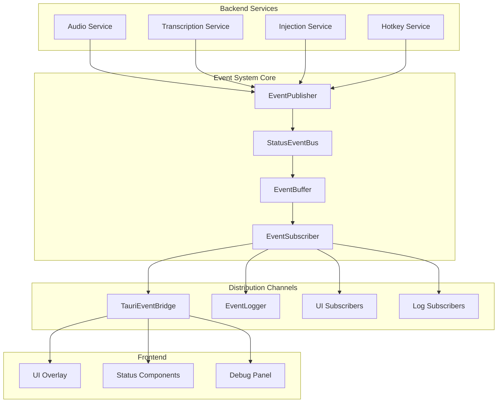

# Design Document

## Overview

The Status Events feature provides a comprehensive real-time event system for broadcasting
application status updates using async channels and the Tauri event system. The design enables
decoupled communication between backend services and frontend components, allowing UI overlays,
logging systems, and other consumers to react to status changes without tight coupling to business
logic. The system emphasizes performance, reliability, and extensibility.

## Architecture

The status events system follows a publisher-subscriber pattern with multiple distribution channels:

- **StatusEventBus**: Central event coordination and distribution
- **EventPublisher**: Service-side API for emitting status events
- **EventSubscriber**: Consumer-side API for receiving status events
- **TauriEventBridge**: Integration with Tauri's event system for frontend communication
- **EventLogger**: Comprehensive logging of all status events
- **EventBuffer**: Buffering and ordering guarantees for event delivery

### Component Interaction



## Components and Interfaces

### StatusEventBus

**Location**: `speakr-core/src/events/bus.rs`

**Responsibilities**:

- Coordinate event distribution to all subscribers
- Maintain event ordering and delivery guarantees
- Handle subscriber registration and cleanup
- Provide event buffering and replay capabilities

**Key Methods**:

```rust
impl StatusEventBus {
    pub fn new() -> Self
    pub async fn publish(&self, event: StatusEvent) -> Result<(), EventError>
    pub async fn subscribe(&self) -> Result<EventReceiver, EventError>
    pub async fn subscribe_filtered(&self, filter: EventFilter) -> Result<EventReceiver, EventError>
    pub fn get_recent_events(&self, count: usize) -> Vec<StatusEvent>
    pub async fn shutdown(&self) -> Result<(), EventError>
}
```

### EventPublisher

**Location**: `speakr-core/src/events/publisher.rs`

**Responsibilities**:

- Provide simple API for services to emit status events
- Handle event creation with timestamps and metadata
- Ensure thread-safe event emission
- Provide typed event creation methods

**Key Methods**:

```rust
impl EventPublisher {
    pub fn new(bus: Arc<StatusEventBus>) -> Self
    pub async fn emit_recording_started(&self) -> Result<(), EventError>
    pub async fn emit_recording_stopped(&self, duration: Duration) -> Result<(), EventError>
    pub async fn emit_transcription_started(&self, model: String) -> Result<(), EventError>
    pub async fn emit_transcription_completed(&self, text: String, confidence: f32) -> Result<(), EventError>
    pub async fn emit_injection_completed(&self, text_length: usize) -> Result<(), EventError>
    pub async fn emit_error(&self, error: AppError, context: String) -> Result<(), EventError>
    pub async fn emit_custom(&self, event: StatusEvent) -> Result<(), EventError>
}
```

### EventSubscriber

**Location**: `speakr-core/src/events/subscriber.rs`

**Responsibilities**:

- Provide API for consuming status events
- Handle event filtering and processing
- Manage subscriber lifecycle and cleanup
- Provide both async and callback-based APIs

**Key Methods**:

```rust
impl EventSubscriber {
    pub fn new(receiver: EventReceiver) -> Self
    pub async fn next_event(&mut self) -> Option<StatusEvent>
    pub async fn next_event_timeout(&mut self, timeout: Duration) -> Result<StatusEvent, EventError>
    pub fn set_filter(&mut self, filter: EventFilter)
    pub async fn close(&mut self)
}

// Callback-based API
pub async fn subscribe_with_callback<F>(
    bus: Arc<StatusEventBus>,
    callback: F,
) -> Result<SubscriptionHandle, EventError>
where
    F: Fn(StatusEvent) + Send + Sync + 'static;
```

## Data Models

### StatusEvent

```rust
#[derive(Debug, Clone, Serialize, Deserialize, PartialEq)]
pub struct StatusEvent {
    pub id: EventId,
    pub timestamp: SystemTime,
    pub event_type: StatusEventType,
    pub source: EventSource,
    pub payload: EventPayload,
}

#[derive(Debug, Clone, Serialize, Deserialize, PartialEq)]
pub enum StatusEventType {
    Recording,
    Transcribing,
    Injected,
    Error,
    ServiceStarted,
    ServiceStopped,
    Heartbeat,
}

#[derive(Debug, Clone, Serialize, Deserialize, PartialEq)]
pub enum EventSource {
    AudioCapture,
    Transcription,
    TextInjection,
    GlobalHotkey,
    Settings,
    System,
}

#[derive(Debug, Clone, Serialize, Deserialize, PartialEq)]
pub enum EventPayload {
    Recording { duration: Option<Duration> },
    Transcription { model: String, text: Option<String>, confidence: Option<f32> },
    Injection { text_length: usize, target_app: Option<String> },
    Error { error: String, context: String, recoverable: bool },
    Service { name: String, status: ServiceStatus },
    Heartbeat { uptime: Duration, memory_usage: u64 },
    Empty,
}
```

### EventFilter

```rust
#[derive(Debug, Clone, PartialEq)]
pub struct EventFilter {
    pub event_types: Option<HashSet<StatusEventType>>,
    pub sources: Option<HashSet<EventSource>>,
    pub min_timestamp: Option<SystemTime>,
    pub max_timestamp: Option<SystemTime>,
}

impl EventFilter {
    pub fn new() -> Self
    pub fn with_types(mut self, types: Vec<StatusEventType>) -> Self
    pub fn with_sources(mut self, sources: Vec<EventSource>) -> Self
    pub fn with_time_range(mut self, start: SystemTime, end: SystemTime) -> Self
    pub fn matches(&self, event: &StatusEvent) -> bool
}
```

### EventError

```rust
#[derive(Debug, Error, Clone, PartialEq)]
pub enum EventError {
    #[error("Event bus is shutdown")]
    BusShutdown,

    #[error("Subscriber channel closed")]
    ChannelClosed,

    #[error("Event buffer overflow")]
    BufferOverflow,

    #[error("Serialization error: {0}")]
    SerializationError(String),

    #[error("Timeout waiting for event")]
    Timeout,

    #[error("Invalid event filter: {0}")]
    InvalidFilter(String),
}
```

## Performance Optimization

### Event Buffering and Batching

```rust
impl EventBuffer {
    const MAX_BUFFER_SIZE: usize = 1000;
    const BATCH_SIZE: usize = 10;
    const FLUSH_INTERVAL: Duration = Duration::from_millis(10);

    pub async fn buffer_event(&self, event: StatusEvent) -> Result<(), EventError> {
        let mut buffer = self.buffer.lock().await;
        buffer.push(event);

        if buffer.len() >= Self::BATCH_SIZE {
            self.flush_buffer(&mut buffer).await?;
        }

        Ok(())
    }

    async fn flush_buffer(&self, buffer: &mut Vec<StatusEvent>) -> Result<(), EventError> {
        if buffer.is_empty() {
            return Ok(());
        }

        let events = buffer.drain(..).collect::<Vec<_>>();
        for subscriber in &self.subscribers {
            for event in &events {
                if let Err(e) = subscriber.send(event.clone()).await {
                    warn!("Failed to deliver event to subscriber: {}", e);
                }
            }
        }

        Ok(())
    }
}
```

### Memory Management

```rust
impl StatusEventBus {
    const MAX_RECENT_EVENTS: usize = 100;

    async fn add_to_recent_events(&self, event: StatusEvent) {
        let mut recent = self.recent_events.lock().await;
        recent.push(event);

        // Keep only the most recent events
        if recent.len() > Self::MAX_RECENT_EVENTS {
            recent.drain(0..recent.len() - Self::MAX_RECENT_EVENTS);
        }
    }
}
```

## Integration Points

### Tauri Event Bridge

```rust
impl TauriEventBridge {
    pub fn new(app_handle: AppHandle, bus: Arc<StatusEventBus>) -> Self {
        let bridge = Self { app_handle, bus };
        bridge.start_event_forwarding();
        bridge
    }

    async fn start_event_forwarding(&self) {
        let mut subscriber = self.bus.subscribe().await.unwrap();
        let app_handle = self.app_handle.clone();

        tokio::spawn(async move {
            while let Some(event) = subscriber.next_event().await {
                let tauri_event_name = match event.event_type {
                    StatusEventType::Recording => "speakr-recording",
                    StatusEventType::Transcribing => "speakr-transcribing",
                    StatusEventType::Injected => "speakr-injected",
                    StatusEventType::Error => "speakr-error",
                    StatusEventType::Heartbeat => "speakr-heartbeat",
                    _ => "speakr-status-changed",
                };

                if let Err(e) = app_handle.emit(tauri_event_name, &event) {
                    error!("Failed to emit Tauri event: {}", e);
                }
            }
        });
    }
}
```

### Service Integration

```rust
// Example integration in AudioService
impl AudioService {
    pub async fn start_recording(&self) -> Result<(), AudioError> {
        // Emit recording started event
        self.event_publisher.emit_recording_started().await?;

        // Perform recording logic
        let result = self.perform_recording().await;

        match result {
            Ok(duration) => {
                self.event_publisher.emit_recording_stopped(duration).await?;
            },
            Err(e) => {
                self.event_publisher.emit_error(
                    AppError::Audio(e.clone()),
                    "Failed to complete audio recording".to_string()
                ).await?;
            }
        }

        result
    }
}
```

### Logging Integration

```rust
impl EventLogger {
    pub fn new(bus: Arc<StatusEventBus>) -> Self {
        let logger = Self { bus };
        logger.start_logging();
        logger
    }

    async fn start_logging(&self) {
        let mut subscriber = self.bus.subscribe().await.unwrap();

        tokio::spawn(async move {
            while let Some(event) = subscriber.next_event().await {
                match event.event_type {
                    StatusEventType::Error => {
                        if let EventPayload::Error { error, context, .. } = &event.payload {
                            error!("Status Error [{}]: {} - {}", event.source, error, context);
                        }
                    },
                    StatusEventType::Recording => {
                        info!("Recording event from {}: {:?}", event.source, event.payload);
                    },
                    StatusEventType::Transcribing => {
                        info!("Transcription event from {}: {:?}", event.source, event.payload);
                    },
                    StatusEventType::Injected => {
                        info!("Injection event from {}: {:?}", event.source, event.payload);
                    },
                    _ => {
                        debug!("Status event [{}]: {:?}", event.source, event.event_type);
                    }
                }
            }
        });
    }
}
```

## Testing Strategy

### Unit Tests

```rust
#[cfg(test)]
mod tests {
    use super::*;
    use tokio::time::{timeout, Duration};

    #[tokio::test]
    async fn test_event_delivery_latency() {
        let bus = Arc::new(StatusEventBus::new());
        let publisher = EventPublisher::new(bus.clone());
        let mut subscriber = bus.subscribe().await.unwrap();

        let start = Instant::now();
        publisher.emit_recording_started().await.unwrap();

        let event = timeout(Duration::from_millis(50), subscriber.next_event())
            .await
            .expect("Event should be delivered within 50ms")
            .expect("Event should be received");

        let latency = start.elapsed();
        assert!(latency < Duration::from_millis(50));
        assert_eq!(event.event_type, StatusEventType::Recording);
    }

    #[tokio::test]
    async fn test_event_ordering() {
        let bus = Arc::new(StatusEventBus::new());
        let publisher = EventPublisher::new(bus.clone());
        let mut subscriber = bus.subscribe().await.unwrap();

        // Emit events in sequence
        publisher.emit_recording_started().await.unwrap();
        publisher.emit_transcription_started("small".to_string()).await.unwrap();
        publisher.emit_injection_completed(100).await.unwrap();

        // Verify events are received in order
        let event1 = subscriber.next_event().await.unwrap();
        let event2 = subscriber.next_event().await.unwrap();
        let event3 = subscriber.next_event().await.unwrap();

        assert_eq!(event1.event_type, StatusEventType::Recording);
        assert_eq!(event2.event_type, StatusEventType::Transcribing);
        assert_eq!(event3.event_type, StatusEventType::Injected);

        // Verify timestamps are in order
        assert!(event1.timestamp <= event2.timestamp);
        assert!(event2.timestamp <= event3.timestamp);
    }
}
```

### Stress Tests

```rust
#[cfg(test)]
mod stress_tests {
    use super::*;

    #[tokio::test]
    async fn test_monkey_test_reliability() {
        let bus = Arc::new(StatusEventBus::new());
        let publisher = EventPublisher::new(bus.clone());
        let mut subscriber = bus.subscribe().await.unwrap();

        const ITERATIONS: usize = 500;
        let mut received_events = Vec::new();

        // Spawn event receiver
        let receiver_handle = tokio::spawn(async move {
            let mut events = Vec::new();
            for _ in 0..ITERATIONS {
                if let Some(event) = subscriber.next_event().await {
                    events.push(event);
                }
            }
            events
        });

        // Emit events rapidly
        for i in 0..ITERATIONS {
            publisher.emit_custom(StatusEvent {
                id: EventId::new(),
                timestamp: SystemTime::now(),
                event_type: StatusEventType::Heartbeat,
                source: EventSource::System,
                payload: EventPayload::Empty,
            }).await.unwrap();
        }

        let received = receiver_handle.await.unwrap();

        // Verify no events were missed
        assert_eq!(received.len(), ITERATIONS);

        // Verify no duplicates
        let mut ids = HashSet::new();
        for event in &received {
            assert!(ids.insert(event.id), "Duplicate event ID found");
        }
    }
}
```
