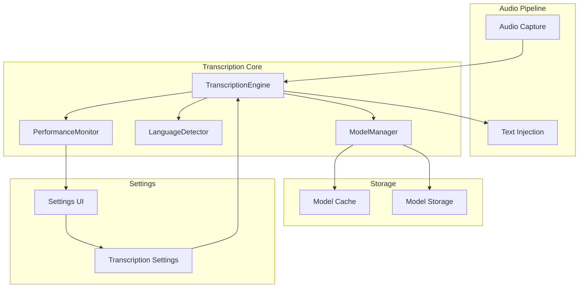

# Design Document

## Overview

The Transcription feature provides offline speech-to-text conversion using Whisper models through
the `whisper-rs` crate. The system processes 16 kHz mono audio samples from the Audio Capture module
and converts them to text using locally-stored GGUF models. The design emphasizes privacy,
performance, and seamless integration with the existing audio pipeline while supporting multiple
model sizes and languages.

## Architecture

The transcription system follows a modular architecture with clear separation between model
management, transcription processing, and pipeline integration:

- **TranscriptionEngine**: Core transcription processing using whisper-rs
- **ModelManager**: Handles model downloading, caching, and lifecycle management
- **LanguageDetector**: Automatic language detection and language-specific optimization
- **PerformanceMonitor**: Tracks latency and performance metrics
- **Pipeline Integration**: Seamless integration with audio capture and text injection

### Component Interaction



## Components and Interfaces

### TranscriptionEngine

**Location**: `speakr-core/src/transcription/engine.rs`

**Responsibilities**:

- Process audio samples using whisper-rs
- Manage Whisper context and state
- Handle model loading and initialization
- Provide async transcription API

**Key Methods**:

```rust
impl TranscriptionEngine {
    pub async fn new(config: TranscriptionConfig) -> Result<Self, TranscriptionError>
    pub async fn transcribe(&self, samples: Vec<i16>) -> Result<TranscriptionResult, TranscriptionError>
    pub async fn change_model(&mut self, model_size: ModelSize) -> Result<(), TranscriptionError>
    pub async fn set_language(&mut self, language: Option<String>) -> Result<(), TranscriptionError>
    pub fn get_performance_metrics(&self) -> PerformanceMetrics
}
```

### ModelManager

**Location**: `speakr-core/src/transcription/models.rs`

**Responsibilities**:

- Download and cache Whisper GGUF models
- Validate model integrity and compatibility
- Manage model storage and cleanup
- Provide model metadata and availability

**Key Methods**:

```rust
impl ModelManager {
    pub fn new(cache_dir: PathBuf) -> Self
    pub async fn ensure_model_available(&self, model_size: ModelSize) -> Result<PathBuf, ModelError>
    pub async fn download_model(&self, model_size: ModelSize) -> Result<(), ModelError>
    pub fn list_available_models(&self) -> Vec<ModelInfo>
    pub fn get_model_path(&self, model_size: ModelSize) -> Option<PathBuf>
    pub async fn validate_model(&self, model_path: &Path) -> Result<(), ModelError>
}
```

### TranscriptionConfig

**Location**: `speakr-types/src/lib.rs`

**Structure**:

```rust
#[derive(Debug, Clone, Serialize, Deserialize, PartialEq)]
pub struct TranscriptionConfig {
    pub model_size: ModelSize,
    pub language: Option<String>,
    pub auto_detect_language: bool,
    pub performance_mode: PerformanceMode,
}

#[derive(Debug, Clone, Serialize, Deserialize, PartialEq)]
pub enum ModelSize {
    Tiny,
    Small,
    Medium,
    Large,
}

#[derive(Debug, Clone, Serialize, Deserialize, PartialEq)]
pub enum PerformanceMode {
    Speed,
    Balanced,
    Accuracy,
}
```

## Data Models

### TranscriptionError

```rust
#[derive(Debug, Error, Clone, PartialEq)]
pub enum TranscriptionError {
    #[error("Model not found: {model_size:?}")]
    ModelNotFound { model_size: ModelSize },

    #[error("Model loading failed: {0}")]
    ModelLoadingFailed(String),

    #[error("Transcription processing failed: {0}")]
    ProcessingFailed(String),

    #[error("Insufficient memory for model: {model_size:?}")]
    InsufficientMemory { model_size: ModelSize },

    #[error("Invalid audio format: {0}")]
    InvalidAudioFormat(String),

    #[error("Language not supported: {language}")]
    UnsupportedLanguage { language: String },

    #[error("Model download failed: {0}")]
    DownloadFailed(String),
}
```

### TranscriptionResult

```rust
#[derive(Debug, Clone, PartialEq)]
pub struct TranscriptionResult {
    pub text: String,
    pub language: Option<String>,
    pub confidence: f32,
    pub processing_time: Duration,
    pub model_used: ModelSize,
    pub segments: Vec<TranscriptionSegment>,
}

#[derive(Debug, Clone, PartialEq)]
pub struct TranscriptionSegment {
    pub text: String,
    pub start_time: Duration,
    pub end_time: Duration,
    pub confidence: f32,
}
```

### ModelInfo

```rust
#[derive(Debug, Clone, PartialEq)]
pub struct ModelInfo {
    pub size: ModelSize,
    pub file_size_mb: u64,
    pub memory_usage_mb: u64,
    pub download_url: String,
    pub is_downloaded: bool,
    pub supports_languages: Vec<String>,
}
```

## Error Handling

### Model Management Errors

1. **Model Not Found**: When requested model is not available locally

   - Attempt automatic download if network is available
   - Suggest alternative model sizes
   - Provide clear download instructions

2. **Model Loading Failures**: When model files are corrupted or incompatible

   - Validate model integrity using checksums
   - Re-download corrupted models automatically
   - Fall back to smaller models if memory is insufficient

3. **Download Failures**: When model download fails
   - Retry with exponential backoff
   - Provide offline mode with available models
   - Clear error messages with troubleshooting steps

### Processing Errors

1. **Audio Format Issues**: When audio samples are invalid

   - Validate sample rate and format before processing
   - Provide detailed error messages about expected format
   - Log audio characteristics for debugging

2. **Memory Constraints**: When insufficient memory for model

   - Monitor memory usage during model loading
   - Suggest smaller model sizes automatically
   - Provide memory usage estimates in UI

3. **Language Detection Failures**: When language cannot be determined
   - Fall back to English as default language
   - Allow manual language override
   - Log detection confidence for debugging

## Performance Considerations

### Model Loading Optimization

- **Lazy Loading**: Load models only when needed
- **Model Caching**: Keep frequently used models in memory
- **Background Loading**: Pre-load models during idle time
- **Memory Management**: Unload unused models to free memory

### Transcription Performance

- **Batch Processing**: Process multiple audio segments efficiently
- **Threading**: Use separate thread for transcription to avoid UI blocking
- **Memory Pools**: Reuse audio buffers to reduce allocations
- **Performance Monitoring**: Track and report latency metrics

### Model Size Recommendations

```rust
impl ModelSize {
    pub fn recommended_for_device() -> Self {
        let available_memory = get_available_memory();
        match available_memory {
            mem if mem < 2_000_000_000 => ModelSize::Tiny,
            mem if mem < 4_000_000_000 => ModelSize::Small,
            mem if mem < 8_000_000_000 => ModelSize::Medium,
            _ => ModelSize::Large,
        }
    }

    pub fn expected_latency(&self) -> Duration {
        match self {
            ModelSize::Tiny => Duration::from_millis(500),
            ModelSize::Small => Duration::from_millis(1500),
            ModelSize::Medium => Duration::from_millis(3000),
            ModelSize::Large => Duration::from_millis(5000),
        }
    }
}
```

## Integration Points

### Audio Capture Integration

The transcription system receives audio samples from the Audio Capture module:

- **Input Format**: `Vec<i16>` samples at 16 kHz mono
- **Sample Validation**: Verify sample rate and format compatibility
- **Buffer Management**: Efficient transfer without additional copying

### Text Injection Integration

Transcription results are passed to the Text Injection system:

- **Output Format**: Plain text string ready for injection
- **Error Propagation**: Clear error handling for failed transcriptions
- **Status Updates**: Real-time feedback during processing

### Settings Integration

Transcription configuration is managed through the settings system:

- **Model Selection**: User-configurable model size preference
- **Language Settings**: Language selection and auto-detection preferences
- **Performance Tuning**: Performance mode selection (speed vs accuracy)

### Pipeline Orchestration

```rust
pub async fn transcription_pipeline(
    audio_samples: Vec<i16>,
    config: TranscriptionConfig,
) -> Result<String, TranscriptionError> {
    let engine = TranscriptionEngine::new(config).await?;
    let result = engine.transcribe(audio_samples).await?;

    // Log performance metrics
    log_performance_metrics(&result);

    Ok(result.text)
}
```

## Testing Strategy

### Unit Tests

1. **Model Loading**: Test model download, caching, and validation
2. **Audio Processing**: Test various audio formats and edge cases
3. **Language Detection**: Test automatic language detection accuracy
4. **Error Handling**: Test all error scenarios and recovery mechanisms

### Integration Tests

1. **Pipeline Integration**: Test complete audio → transcription → text flow
2. **Performance Tests**: Verify latency requirements on target hardware
3. **Model Switching**: Test runtime model changes without restart
4. **Memory Usage**: Monitor memory consumption with different models

### Performance Benchmarks

1. **Latency Measurement**: Track 95th percentile transcription times
2. **Memory Profiling**: Monitor memory usage across model sizes
3. **Accuracy Testing**: Compare transcription quality across models
4. **Network Isolation**: Verify no network calls during transcription
