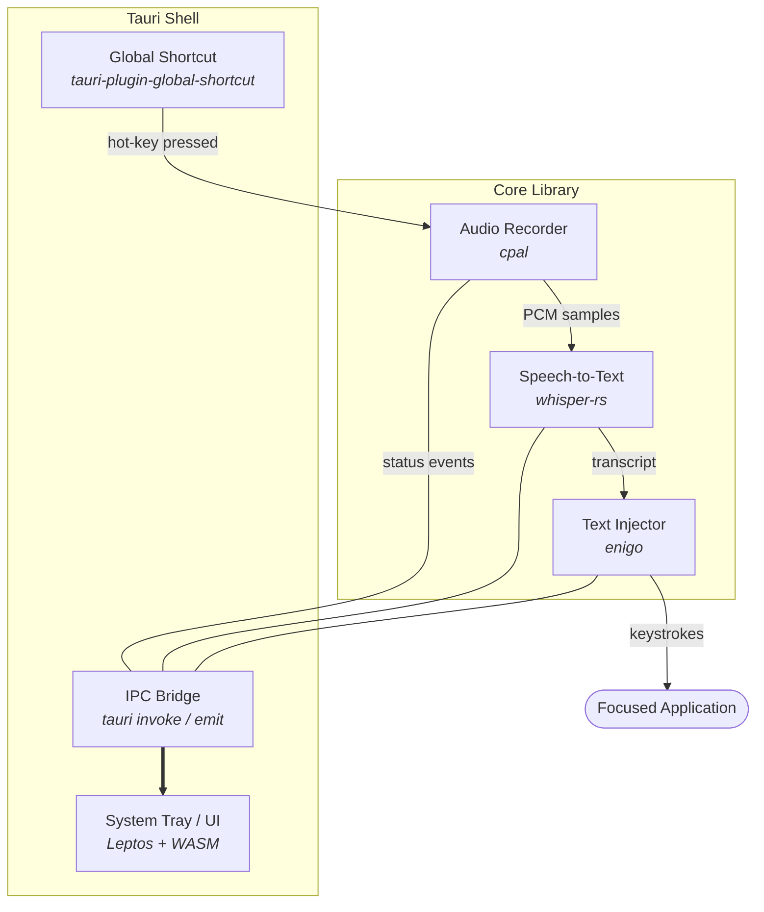

# Speakr – Technical Architecture

- [1. Purpose](#1-purpose)
- [2. High-Level Architecture](#2-high-level-architecture)
- [3. Crate \& Directory Layout](#3-crate--directory-layout)
  - [speakr-types: Unified Type System](#speakr-types-unified-type-system)
  - [3.1 Speakr-Tauri Internal Structure](#31-speakr-tauri-internal-structure)
- [4. Runtime Flow (Happy Path)](#4-runtime-flow-happy-path)
  - [Settings Integration](#settings-integration)
  - [Workflow Error Handling](#workflow-error-handling)
- [5. Concurrency \& Safety](#5-concurrency--safety)
- [6. Security \& Permissions](#6-security--permissions)
  - [6.1 System Permissions](#61-system-permissions)
  - [6.2 Data Security \& Input Validation](#62-data-security--input-validation)
- [7. Build \& Packaging](#7-build--packaging)
- [8. Extensibility Points](#8-extensibility-points)
- [9. Risks \& Mitigations](#9-risks--mitigations)
- [10. Future Roadmap](#10-future-roadmap)

## 1. Purpose

Speakr is a **privacy-first hot-key dictation utility** for macOS (with Windows/Linux on the
roadmap). When the user presses a global shortcut, it records a short audio segment, runs an
**on-device Whisper model**, and synthesises keystrokes to **type** the transcript into the
currently-focused application – all in under a few seconds.

---

## 2. High-Level Architecture



Key points:

1. **All heavy-weight logic lives in pure Rust** (`speakr-core`). The UI may be hidden without
   affecting functionality.
2. **No network access** – Whisper runs entirely on-device.
3. **Plugin isolation** – Optional features (auto-start, clipboard, etc.) are added via Tauri
   plugins with explicit capability JSON.

---

## 3. Crate & Directory Layout

| Layer    | Crate / Path            | Main Responsibilities                                                             |
| -------- | ----------------------- | --------------------------------------------------------------------------------- |
| Core     | `speakr-core/`          | Record audio (cpal) ➜ transcribe (whisper-rs) ➜ inject text (enigo)               |
|          | `├── audio/`            | Audio capture and recording with configurable duration                            |
|          | `├── model/`            | Whisper model management and metadata handling                                    |
|          | `└── transcription/`    | Speech-to-text engine, language detection, and performance monitoring             |
| Types    | `speakr-types/`         | Shared type system: settings, errors, transcription types, and service status     |
| Backend  | `speakr-tauri/`         | Registers global hot-key, exposes `#[tauri::command]` wrappers, persists settings |
| Frontend | `speakr-ui/` (optional) | Leptos WASM UI for tray, preferences, status overlay                              |
| Assets   | `models/`               | GGUF Whisper models **cached** post-install (managed by `ModelManager`, stored under `~/Library/Application Support/Speakr/models`) |

All crates live in a single **Cargo workspace** to guarantee compatible dependency versions.

### speakr-types: Unified Type System

The `speakr-types` crate provides the shared type system used across all components:

**Transcription Types:**

- `PerformanceMode` - Processing optimisation (Speed, Balanced, Accuracy)
- `TranscriptionConfig` - Configuration for model size, language, and performance preferences
- `TranscriptionError` - Comprehensive error handling for model, processing, and language failures
- `TranscriptionResult` - Complete transcription output with text, confidence, timing, and segments
- `TranscriptionSegment` - Individual segments with precise timing and confidence metrics

**Core Infrastructure:**

- `AppSettings` - Application configuration with validation and migration support
- `AppError` / `HotkeyError` - Unified error types for consistent error handling
- `BackendStatus` / `ServiceStatus` - System health monitoring and status reporting
- `ModelSize` / `ModelInfo` - Whisper model management and metadata

### 3.1 Speakr-Tauri Internal Structure

The `speakr-tauri` backend is organised into focused modules for maintainability and testability:

```text
speakr-tauri/src/
├── commands/           # Tauri command implementations
│   ├── mod.rs         # Command organisation and documentation
│   ├── validation.rs  # Input validation (hotkey format, etc.)
│   ├── system.rs      # System integration (model availability, auto-launch)
│   └── legacy.rs      # Backward compatibility commands
├── services/          # Background services and state management
│   ├── mod.rs         # Service coordination
│   ├── hotkey.rs      # Global hotkey registration and management
│   ├── status.rs      # Backend service status tracking
│   └── types.rs       # Shared service types and enums
├── settings/          # Configuration persistence and validation
│   ├── mod.rs         # Settings management
│   ├── persistence.rs # File I/O, atomic operations, and security controls
│   ├── migration.rs   # Settings schema migration
│   ├── validation.rs  # Settings validation logic
│   └── traits.rs      # Settings loading traits for dependency injection
├── debug/             # Debug-only functionality
│   ├── mod.rs         # Debug command coordination
│   ├── commands.rs    # Debug-specific Tauri commands
│   ├── storage.rs     # Debug log storage
│   └── types.rs       # Debug-specific types
├── audio/             # Audio handling utilities
│   ├── mod.rs         # Audio module coordination
│   ├── files.rs       # Audio file operations
│   └── recording.rs   # Audio recording helpers
├── workflow.rs        # Dictation workflow orchestration
└── lib.rs             # Tauri app setup, command registration

tests/
├── workflow_tests.rs  # Integration tests for dictation pipeline
├── settings_tests.rs  # Settings persistence and validation tests
├── hotkey_tests.rs    # Global hotkey functionality tests
└── integration_tests.rs # Cross-module integration tests
```

**Key architectural principles:**

- **Separation of concerns**: Business logic in `*_internal()` functions, Tauri integration in
  `lib.rs`
- **Testability**: Internal functions can be tested without Tauri runtime overhead
- **Modularity**: Commands grouped by functional domain rather than technical implementation
- **Settings integration**: All configurable behaviour loads from persistent user settings
- **Workflow orchestration**: Complete dictation pipeline managed in `workflow.rs`
- **Comprehensive testing**: Integration tests validate end-to-end functionality
- **Documentation**: Each module has comprehensive rustdoc explaining its purpose and usage

---

## 4. Runtime Flow (Happy Path)

| Step | Thread/Task            | Action                                                           | Typical Latency                 |
| ---- | ---------------------- | ---------------------------------------------------------------- | ------------------------------- |
| 1    | Main (OS)              | User presses configured hotkey (loaded from settings at startup) | –                               |
| 2    | Tauri shortcut handler | Spawns async task `execute_dictation_workflow()`                 | < 1 ms                          |
| 3    | Workflow orchestrator  | Loads audio duration from user settings (1-30s configurable)     | < 10 ms                         |
| 4    | Tokio worker           | `cpal::Stream` captures 16-kHz mono PCM into ring-buffer         | 0–30 s (user configurable)      |
| 5    | Same task              | PCM fed into `whisper_rs::full()`                                | ~1 s per 10 s audio on M-series |
| 6    | Same task              | Transcript returned → `enigo.text()` synthesises keystrokes      | ≤ 300 ms                        |
| 7    | UI task                | Frontend receives status events via `emit()` and updates overlay | realtime                        |

### Settings Integration

The workflow system integrates deeply with user settings:

- **Audio Duration**: Recording duration (1-30 seconds) loaded from
  `AppSettings.audio_duration_secs`
- **Hotkey Configuration**: Global hotkey combination loaded from `AppSettings.hot_key` at startup
- **Model Selection**: Whisper model size loaded from `AppSettings.model_size` (placeholder)
- **Fallback Behaviour**: Default values used when settings loading fails
- **Validation**: All settings validated before persistence with comprehensive error handling
- **Migration**: Schema versioning supports settings format evolution

### Workflow Error Handling

Each workflow step includes comprehensive error handling:

- **Audio Capture Errors**: Device unavailable, permission denied, format issues
- **Transcription Errors**: Comprehensive error handling with `TranscriptionError` enum covering:
  - Model not found or loading failures (automatic fallback to smaller model if memory limited)
  - Insufficient memory for selected model size (returns `InsufficientMemory`, provides suggestions)
  - Processing failures during transcription
  - Invalid audio format issues
  - Unsupported language detection
  - Model download failures

The `TranscriptionError` type now exposes helper methods:

- `user_message()` – short, localised strings for UI toast/alert
- `suggestions()` – actionable recovery tips displayed alongside errors
- **Text Injection Errors**: Permission issues, target application problems (placeholder
  implementation)
- **Settings Errors**: Invalid configuration, file system issues, validation failures
- **Recovery Mechanisms**: Graceful degradation and user feedback via status events

Failure cases (no mic, model missing, permission denied) surface via error events and native
notifications.

---

## 5. Concurrency & Safety

- **Tokio** multi-thread runtime drives asynchronous recording and Whisper inference.
- The `AppState(Mutex<Option<Speakr>>)` guards the singleton Whisper context; loading occurs once at
  app start.
- Hot-key handler offloads work to the runtime to keep the UI thread non-blocking.
- Audio buffer uses a bounded `sync_channel` to avoid unbounded RAM growth.

---

## 6. Security & Permissions

### 6.1 System Permissions

| Platform | Permission        | Why                       | Request Mechanism                                     |
| -------- | ----------------- | ------------------------- | ----------------------------------------------------- |
| macOS    | Microphone access | Record audio              | `NSMicrophoneUsageDescription` (Info.plist)           |
| macOS    | Accessibility     | Send synthetic keystrokes | User enables app in _System Settings ▸ Accessibility_ |
| All      | Global shortcut   | Register hot-key          | `global-shortcut:allow-register` capability           |

### 6.2 Data Security & Input Validation

The application implements comprehensive security measures for data handling:

**Settings Security:**

- **File Size Limits**: Settings files are limited to 64KB to prevent DoS attacks
- **Unknown Field Rejection**: All deserializable structs use `#[serde(deny_unknown_fields)]` to
  reject malicious JSON with extra fields
- **Path Traversal Protection**: File path validation rejects `..`, absolute paths, and control
  characters
- **Enhanced Error Messages**: `serde_path_to_error` provides detailed JSON parsing errors with
  field paths
- **Atomic File Operations**: Settings are written atomically with backup/recovery mechanisms

**Runtime Security:**

- **No Network Access**: All processing happens locally; no data leaves the device
- **Input Sanitization**: All user inputs are validated before processing
- **Error Handling**: Comprehensive error types prevent information leakage
- **Test Isolation**: Filesystem tests use temporary directories to avoid touching user data

---

## 7. Build & Packaging

1. **Dev**: `trunk serve &` (frontend) + `cargo tauri dev` (backend)
2. **Release**: `trunk build --release` ➜ `cargo tauri build`
3. macOS notarisation: `xcrun notarytool submit --wait` after codesign.
4. Universal binary size ≈ 15 MB (+ model).

---

## 8. Extensibility Points

- **Voice Activity Detection**: plug-in `webrtc-vad` before Whisper to auto-stop on silence.
- **Streaming transcripts**: call `whisper_rs::full_partial()` and enqueue keystrokes incrementally.
- **Multi-language**: set `params.set_language(None)` for auto-detect.
- **Cross-platform**: replace `enigo` backend with `send_input` (Win) or `xdo` (X11) while keeping
  public API.

---

## 9. Risks & Mitigations

| Risk                                         | Mitigation                                                                |
| -------------------------------------------- | ------------------------------------------------------------------------- |
| Keystroke injection blocked in secure fields | Fallback to clipboard-paste mode with warning                             |
| Whisper latency on older CPUs                | Offer `tiny.en.gguf` and shorter max record time                          |
| Shortcut clashes                             | UI lets user redefine hot-key, validates uniqueness, persists to settings |
| Model file missing/corrupt                   | Verify checksum on load and show error dialogue                           |

---

## 10. Future Roadmap

1. **Settings sync** via `tauri-plugin-store` (JSON in AppData).
2. **Auto-start on login** (`tauri-plugin-autostart`).
3. **GPU inference** when Whisper Metal backend stabilises.
4. **Installer bundles** (DMG/MSI/DEB) with model downloader.

---

_This document replaces the previous placeholder `docs/ARCHITECTURE.md` and should be kept_
_up-to-date with all architectural changes._
