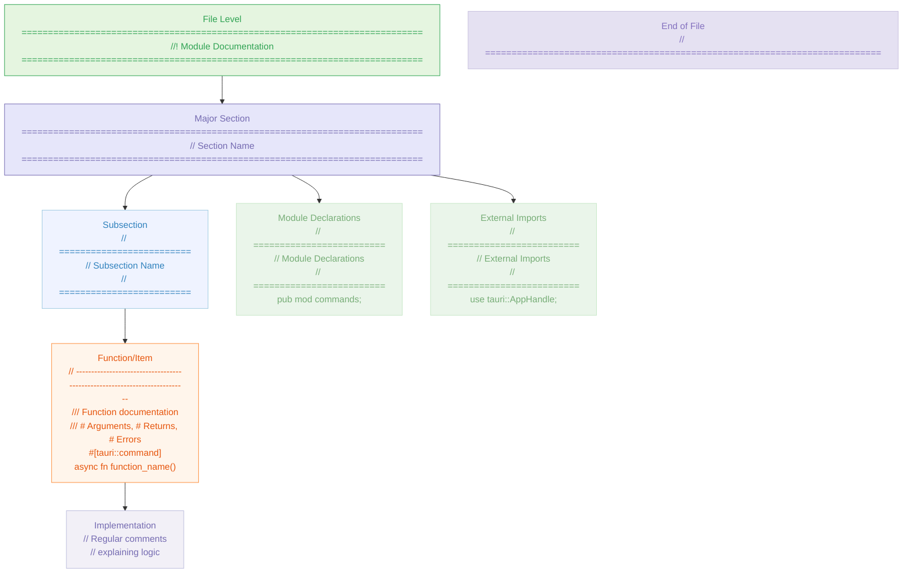

# Rust Documentation Tracking

## Instructions

**Original Prompt**: Add detailed comments to all functions etc in the files and clean up each
file, remove orphaned comments, group code logically (e.g. tauri::commands together) and add
large comment signposts to help navigate the file easily.

**Documentation Standards**:

- Add detailed rustdoc comments to all functions, commands, and relevant items
- Remove orphaned or outdated comments
- Group code logically with clear comment signposts for easy navigation
- Ensure all public items are fully documented, including parameters, errors, and usage
  examples where appropriate
- Use large comment blocks (e.g.,
  `// ============================================================================`) for major
  sections
- Use smaller comment dividers (e.g.,
  `// --------------------------------------------------------------------------`) for individual
  functions
- Follow Rust documentation best practices and project coding standards

## Progress Tracking

1. Select an **UNCHECKED** `[ ]` item from the list.
2. **IMMEDIATELY** add a progress indicator to the item: `[~]`
3. Comment the file following the instructions in this document.
4. **On COMPLETION**, add a checkmark to the item in the list: `[x]`
5. Verify your changes using `precommit run ...` (formats, lints and runs tests)
6. Fix any errors or warnings and repeat step 5 until no errors or warnings remain
7. Commit your changes to Git.
8. Return to step 1 until all items are checked.

### speakr-core/src/

- [x] `lib.rs` ✅ **COMPLETED**
- [ ] `audio/mod.rs`
- [ ] `model/mod.rs`
- [ ] `model/list.rs`
- [ ] `model/list_updater.rs`
- [ ] `model/list_tests.rs`
- [ ] `model/metadata.rs`
- [ ] `bin/update_models.rs`
- [ ] `bin/update_models_tui.rs`

### speakr-tauri/src/

- [x] `lib.rs` ✅ **COMPLETED**
- [ ] `main.rs`
- [ ] `audio/mod.rs`
- [ ] `audio/files.rs`
- [ ] `audio/recording.rs`
- [ ] `commands/mod.rs`
- [ ] `commands/legacy.rs`
- [ ] `commands/system.rs`
- [ ] `commands/validation.rs`
- [ ] `debug/mod.rs`
- [ ] `debug/commands.rs`
- [ ] `debug/storage.rs`
- [ ] `debug/types.rs`
- [ ] `services/mod.rs`
- [ ] `services/hotkey.rs`
- [ ] `services/status.rs`
- [ ] `services/types.rs`
- [ ] `settings/mod.rs`
- [ ] `settings/commands.rs`
- [ ] `settings/migration.rs`
- [ ] `settings/persistence.rs`
- [ ] `settings/validation.rs`

### speakr-types/src/

- [x] `lib.rs` ✅ **COMPLETED**

### speakr-ui/src/

- [ ] `lib.rs`
- [ ] `app.rs`
- [ ] `debug.rs`
- [ ] `settings.rs`

### Test Files

#### speakr-core/tests/

- [ ] `audio_capture.rs`

#### speakr-tauri/tests/

- [ ] `audio_tests.rs`
- [ ] `commands_tests.rs`
- [ ] `debug_save.rs`
- [ ] `global_hotkey.rs`
- [ ] `hotkey_tests.rs`
- [ ] `integration_tests.rs`
- [ ] `settings_tests.rs`
- [ ] `status_tests.rs`

## Comment Style Examples

Use these exact patterns for consistency across all files:

### Comment Hierarchy Structure



### File-Level Documentation

```rust
// ============================================================================
//! Module name and purpose.
//!
//! This module provides functionality for:
//! - Feature 1
//! - Feature 2
//! - Feature 3
// ============================================================================
```

### Major Section Dividers

```rust
// ============================================================================
// Section Name (e.g., "Tauri Command Definitions")
// ============================================================================
```

### Subsection Headers

```rust
// =========================
// Subsection Name (e.g., "Debug Commands (Debug Only)")
// =========================
```

### Function/Item Dividers

```rust
// --------------------------------------------------------------------------
/// Function description with full rustdoc.
///
/// # Arguments
/// * `param` - Parameter description
///
/// # Returns
/// Returns description.
///
/// # Errors
/// Error conditions.
///
/// # Examples
/// ```no_run
/// // Usage example
/// ```
#[tauri::command]
async fn function_name() -> Result<(), AppError> {
    // Implementation
}
```

### Module Declarations Section

```rust
// =========================
// Module Declarations
// =========================
pub mod commands;
pub mod services;
// etc.
```

### Import Section

```rust
// =========================
// External Imports
// =========================
use std::collections::HashMap;
use tauri::{AppHandle, Manager};
// etc.
```

### Setup/Initialization Comments

```rust
// =========================
// Initial Setup (Description of what's being set up)
// =========================
```

### End-of-File Marker

```rust
// ===========================================================================
```

### Rustdoc Comment Patterns

#### Standard Function Documentation

```rust
/// Brief one-line description of what the function does.
///
/// More detailed explanation if needed, including behavior,
/// side effects, and important implementation details.
///
/// # Arguments
/// * `param1` - Description of first parameter
/// * `param2` - Description of second parameter
///
/// # Returns
/// Description of return value and what it represents.
///
/// # Errors
/// Description of when and why the function might return an error.
///
/// # Examples
/// ```no_run
/// let result = function_name(param1, param2)?;
/// assert_eq!(result, expected_value);
/// ```
```

#### Tauri Command Documentation

```rust
/// Brief description of the command's purpose.
///
/// # Arguments
/// * `param` - Parameter description
///
/// # Returns
/// Returns `Ok(())` on success.
///
/// # Errors
/// Returns `AppError` if the operation fails.
///
/// # Example
/// ```no_run
/// // In frontend: invoke('command_name', { param })
/// ```
```

#### Debug-Only Function Documentation

```rust
/// Debug: Brief description of debug functionality.
///
/// This function is only available in debug builds.
```

#### Module Documentation

```rust
//! Module name and purpose.
//!
//! This module provides [specific functionality] for the Speakr application:
//! - Feature/capability 1
//! - Feature/capability 2
//! - Feature/capability 3
//!
//! # Usage
//! Brief usage example or important notes.
```

## Documentation Checklist Template

For each file, ensure:

- [ ] **File-level documentation**: Module-level rustdoc comment explaining purpose and contents
- [ ] **Function documentation**: All public functions have comprehensive rustdoc
  - [ ] Purpose and behavior description
  - [ ] Parameters documented with `# Arguments`
  - [ ] Return values documented with `# Returns`
  - [ ] Error conditions documented with `# Errors`
  - [ ] Usage examples where appropriate with `# Examples`
- [ ] **Type documentation**: All public structs, enums, and traits documented
- [ ] **Large comment signposts**: Major sections clearly marked
- [ ] **Code organization**: Related code grouped logically
- [ ] **Orphaned comments**: Removed outdated or irrelevant comments
- [ ] **Formatting**: Consistent with rustfmt standards
- [ ] **Testing**: Code compiles and tests pass after changes

## Priority Order

1. **High Priority** (Core functionality):
   - `speakr-types/src/lib.rs` (shared types)
   - `speakr-core/src/lib.rs` (core functionality)
   - `speakr-tauri/src/main.rs` (application entry)

2. **Medium Priority** (Services and commands):
   - `speakr-tauri/src/services/*` (service modules)
   - `speakr-tauri/src/commands/*` (command modules)
   - `speakr-tauri/src/settings/*` (settings modules)

3. **Lower Priority** (Supporting modules):
   - `speakr-tauri/src/audio/*` (audio modules)
   - `speakr-tauri/src/debug/*` (debug modules)
   - `speakr-ui/src/*` (UI modules)
   - `speakr-core/src/model/*` (model modules)

4. **Test Files** (Documentation focused on test clarity):
   - All test files in `tests/` directories

## Notes

- **Completed**: `speakr-tauri/src/lib.rs` - Comprehensive documentation added with clear
  sections and detailed rustdoc comments
- **Next Target**: Recommend starting with `speakr-types/src/lib.rs` as it contains shared
  types used across the project
- **Testing**: Always run `cargo fmt`, `cargo clippy`, and `cargo test` before committing
  changes
- **Commit Strategy**: Document and commit files in logical groups (e.g., all service files
  together)
