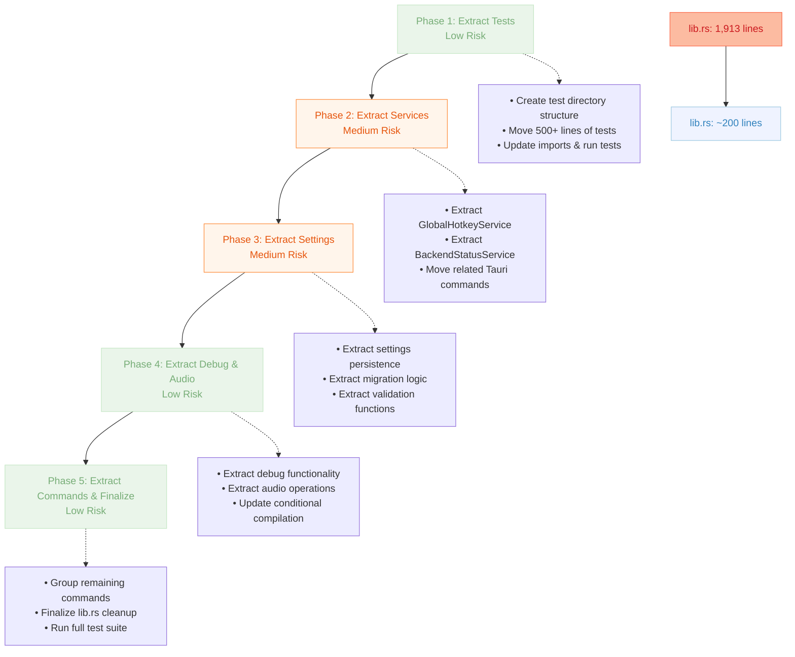

# Speakr-Tauri lib.rs Refactoring Plan

## Current State Analysis

The `speakr-tauri/src/lib.rs` file has grown to **2,000 lines** and contains multiple
responsibilities that should be separated for better maintainability.

### Current File Composition

- **Lines 1-27**: Imports and use statements
- **Lines 29-87**: Debug-only types and static storage
- **Lines 89-255**: Settings management utilities
- **Lines 256-456**: GlobalHotkeyService implementation
- **Lines 457-600**: Tauri command functions
- **Lines 601-950**: Audio functionality helpers
- **Lines 951-1100**: Additional utility functions
- **Lines 1732-1830**: BackendStatusService implementation
- **Lines 1831-1913**: Main run function and setup
- **Lines 1400+**: Extensive test module (500+ lines)

## Proposed Refactoring Structure

### 1. Move Tests to Separate Files

**Target**: Extract all tests from `lib.rs` into dedicated test files

- **Current**: 500+ lines of tests in `mod tests`
- **New Structure**:

  ```text
  speakr-tauri/tests/
  ├── settings_tests.rs       # Settings save/load/migration tests
  ├── hotkey_tests.rs         # GlobalHotkeyService tests
  ├── status_tests.rs         # BackendStatusService tests
  ├── audio_tests.rs          # Audio recording/file tests
  ├── commands_tests.rs       # Tauri command tests
  └── integration_tests.rs    # Cross-module integration tests
  ```

- **Benefits**: Reduces `lib.rs` by ~500 lines, improves test organization
- **Note**: Integration tests can access internal modules via `speakr_tauri::module_name`

### 2. Extract Debug Functionality

**Target**: Move all debug-related code to separate module

- **Current**: Debug types, static storage, debug commands scattered throughout
- **New Structure**:

  ```text
  speakr-tauri/src/debug/
  ├── mod.rs                  # Public interface, re-exports
  ├── types.rs                # DebugLogLevel, DebugLogMessage, DebugRecordingState
  ├── storage.rs              # Static storage (DEBUG_LOG_MESSAGES, DEBUG_RECORDING_STATE)
  └── commands.rs             # Debug Tauri commands
  ```

- **Files to Create**:
  - `src/debug/types.rs`: ~50 lines
  - `src/debug/storage.rs`: ~30 lines
  - `src/debug/commands.rs`: ~200 lines
  - `src/debug/mod.rs`: ~20 lines
- **Benefits**: Isolates debug code, easier to disable in release builds

### 3. Extract Settings Management

**Target**: Centralize all settings-related functionality

- **Current**: Settings utilities and commands mixed in main file
- **New Structure**:

  ```text
  speakr-tauri/src/settings/
  ├── mod.rs                  # Public interface
  ├── persistence.rs          # File I/O, atomic writes, backups
  ├── migration.rs            # Version migration logic
  ├── validation.rs           # Directory permissions, data validation
  └── commands.rs             # Settings Tauri commands
  ```

- **Functions to Move**:
  - `get_settings_path()`, `get_settings_backup_path()`
  - `migrate_settings()`, `save_settings_to_dir()`, `load_settings_from_dir()`
  - `try_load_settings_file()`, `validate_settings_directory_permissions()`
  - Commands: `save_settings()`, `load_settings()`
- **Files to Create**:
  - `src/settings/persistence.rs`: ~150 lines
  - `src/settings/migration.rs`: ~50 lines
  - `src/settings/validation.rs`: ~40 lines
  - `src/settings/commands.rs`: ~60 lines
  - `src/settings/mod.rs`: ~30 lines
- **Benefits**: Clear separation of concerns, easier testing of settings logic

### 4. Extract Service Implementations

**Target**: Move service structs to dedicated service modules

- **Current**: GlobalHotkeyService and BackendStatusService in main file
- **New Structure**:

  ```text
  speakr-tauri/src/services/
  ├── mod.rs                  # Re-exports, common traits
  ├── hotkey.rs              # GlobalHotkeyService implementation
  ├── status.rs              # BackendStatusService implementation
  └── types.rs               # ServiceComponent enum, shared types
  ```

- **Content to Move**:
  - `GlobalHotkeyService` struct (~200 lines)
  - `BackendStatusService` struct (~100 lines)
  - `ServiceComponent` enum
  - Related Tauri commands: `register_global_hotkey()`, `unregister_global_hotkey()`
- **Files to Create**:
  - `src/services/hotkey.rs`: ~220 lines
  - `src/services/status.rs`: ~120 lines
  - `src/services/types.rs`: ~20 lines
  - `src/services/mod.rs`: ~30 lines
- **Benefits**: Services become self-contained, easier to test and maintain

### 5. Extract Audio Functionality

**Target**: Isolate audio recording and file operations

- **Current**: Audio functions scattered throughout main file
- **New Structure**:

  ```text
  speakr-tauri/src/audio/
  ├── mod.rs                  # Public interface
  ├── recording.rs           # Recording logic, real audio backend
  ├── files.rs               # WAV file operations, filename generation
  └── commands.rs            # Audio-related Tauri commands
  ```

- **Functions to Move**:
  - `generate_audio_filename_with_timestamp()`
  - `save_audio_samples_to_wav_file()`
  - `debug_record_audio_to_file()`, `debug_record_real_audio_to_file()`
  - `get_debug_recordings_directory()`
  - Commands: `debug_start_recording()`, `debug_stop_recording()`
- **Files to Create**:
  - `src/audio/recording.rs`: ~100 lines
  - `src/audio/files.rs`: ~80 lines
  - `src/audio/commands.rs`: ~150 lines
  - `src/audio/mod.rs`: ~25 lines
- **Benefits**: Audio logic becomes testable in isolation

### 6. Extract General Tauri Commands

**Target**: Group remaining Tauri commands by domain

- **Current**: Various commands mixed in main file
- **New Structure**:

  ```text
  speakr-tauri/src/commands/
  ├── mod.rs                  # Command registration, re-exports
  ├── validation.rs          # validate_hot_key, input validation
  ├── system.rs              # check_model_availability, set_auto_launch
  └── legacy.rs              # register_hot_key (backward compatibility)
  ```

- **Commands to Move**:
  - `validate_hot_key()` → validation.rs
  - `check_model_availability()`, `set_auto_launch()` → system.rs
  - `register_hot_key()`, `greet()` → legacy.rs
  - `get_backend_status()` → (might stay in services/status.rs)
- **Files to Create**:
  - `src/commands/validation.rs`: ~60 lines
  - `src/commands/system.rs`: ~80 lines
  - `src/commands/legacy.rs`: ~40 lines
  - `src/commands/mod.rs`: ~40 lines
- **Benefits**: Commands grouped by domain, easier to find and maintain

### 7. Simplified lib.rs

**Target**: Reduce `lib.rs` to essential coordination code

- **Final Content**:
  - Module declarations and re-exports
  - Main `run()` function with Tauri setup
  - Essential imports
  - Command registration (delegated to modules)
- **Estimated Size**: ~150-200 lines (down from 1,913)

## Implementation Strategy

1. [ ] [Phase 1: Extract Tests](./refactor/SPEAKR-TAURI_LIB-RS_PHASE_1.md)
2. [ ] [Phase 2: Extract Services](./refactor/SPEAKR-TAURI_LIB-RS_PHASE_2.md)
3. [ ] [Phase 3: Extract Settings](./refactor/SPEAKR-TAURI_LIB-RS_PHASE_3.md)
4. [ ] [Phase 4: Extract Debug & Audio](./refactor/SPEAKR-TAURI_LIB-RS_PHASE_4.md)
5. [ ] [Phase 5: Extract Commands & Finalize](./refactor/SPEAKR-TAURI_LIB-RS_PHASE_5.md)

## Refactoring Process Overview

The following diagram illustrates the 5-phase refactoring approach and its progression from the
current monolithic structure to a modular architecture:



## Risk Assessment

### Low Risk Refactoring

- ✅ Moving tests to separate files
- ✅ Extracting debug functionality (conditional compilation)
- ✅ Moving utility functions (no complex dependencies)

### Medium Risk Refactoring

- ⚠️ Service extraction (careful with state management)
- ⚠️ Settings refactoring (critical for app functionality)
- ⚠️ Tauri command reorganization (frontend depends on these)

### Mitigation Strategies

- **Incremental Changes**: One module at a time
- **Comprehensive Testing**: Run full test suite after each phase
- **Feature Flags**: Use conditional compilation during transition
- **Backup Strategy**: Git branches for each refactoring phase

## Success Criteria

- [ ] `lib.rs` reduced to ~200 lines
- [ ] All existing tests pass without modification
- [ ] All Tauri commands remain accessible to frontend
- [ ] Debug functionality preserved in debug builds
- [ ] Settings persistence works identically
- [ ] Global hotkey registration continues working
- [ ] Build time remains similar or improves
- [ ] New module structure is logical and discoverable

This refactoring will significantly improve the maintainability and organization of the Speakr
Tauri backend while preserving all existing functionality.
