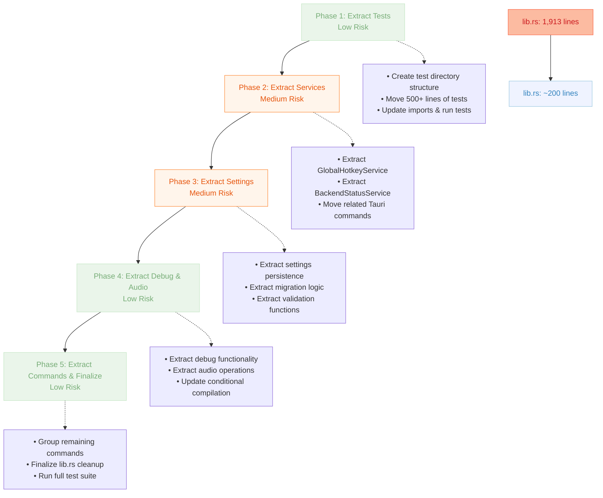

# Speakr-Tauri lib.rs Refactoring Plan

## Current State Analysis

The `speakr-tauri/src/lib.rs` file has grown to **1,913 lines** and contains multiple
responsibilities that should be separated for better maintainability.

### Current File Composition

- **Lines 1-27**: Imports and use statements
- **Lines 29-87**: Debug-only types and static storage
- **Lines 89-255**: Settings management utilities
- **Lines 256-456**: GlobalHotkeyService implementation
- **Lines 457-600**: Tauri command functions
- **Lines 601-950**: Audio functionality helpers
- **Lines 951-1100**: Additional utility functions
- **Lines 1732-1830**: BackendStatusService implementation
- **Lines 1831-1913**: Main run function and setup
- **Lines 1400+**: Extensive test module (500+ lines)

## Proposed Refactoring Structure

### 1. Move Tests to Separate Files

**Target**: Extract all tests from `lib.rs` into dedicated test files

- **Current**: 500+ lines of tests in `mod tests`
- **New Structure**:

  ```text
  speakr-tauri/tests/
  ├── settings_tests.rs       # Settings save/load/migration tests
  ├── hotkey_tests.rs         # GlobalHotkeyService tests
  ├── status_tests.rs         # BackendStatusService tests
  ├── audio_tests.rs          # Audio recording/file tests
  ├── commands_tests.rs       # Tauri command tests
  └── integration_tests.rs    # Cross-module integration tests
  ```

- **Benefits**: Reduces `lib.rs` by ~500 lines, improves test organization
- **Note**: Integration tests can access internal modules via `speakr_tauri::module_name`

### 2. Extract Debug Functionality

**Target**: Move all debug-related code to separate module

- **Current**: Debug types, static storage, debug commands scattered throughout
- **New Structure**:

  ```text
  speakr-tauri/src/debug/
  ├── mod.rs                  # Public interface, re-exports
  ├── types.rs                # DebugLogLevel, DebugLogMessage, DebugRecordingState
  ├── storage.rs              # Static storage (DEBUG_LOG_MESSAGES, DEBUG_RECORDING_STATE)
  └── commands.rs             # Debug Tauri commands
  ```

- **Files to Create**:
  - `src/debug/types.rs`: ~50 lines
  - `src/debug/storage.rs`: ~30 lines
  - `src/debug/commands.rs`: ~200 lines
  - `src/debug/mod.rs`: ~20 lines
- **Benefits**: Isolates debug code, easier to disable in release builds

### 3. Extract Settings Management

**Target**: Centralize all settings-related functionality

- **Current**: Settings utilities and commands mixed in main file
- **New Structure**:

  ```text
  speakr-tauri/src/settings/
  ├── mod.rs                  # Public interface
  ├── persistence.rs          # File I/O, atomic writes, backups
  ├── migration.rs            # Version migration logic
  ├── validation.rs           # Directory permissions, data validation
  └── commands.rs             # Settings Tauri commands
  ```

- **Functions to Move**:
  - `get_settings_path()`, `get_settings_backup_path()`
  - `migrate_settings()`, `save_settings_to_dir()`, `load_settings_from_dir()`
  - `try_load_settings_file()`, `validate_settings_directory_permissions()`
  - Commands: `save_settings()`, `load_settings()`
- **Files to Create**:
  - `src/settings/persistence.rs`: ~150 lines
  - `src/settings/migration.rs`: ~50 lines
  - `src/settings/validation.rs`: ~40 lines
  - `src/settings/commands.rs`: ~60 lines
  - `src/settings/mod.rs`: ~30 lines
- **Benefits**: Clear separation of concerns, easier testing of settings logic

### 4. Extract Service Implementations

**Target**: Move service structs to dedicated service modules

- **Current**: GlobalHotkeyService and BackendStatusService in main file
- **New Structure**:

  ```text
  speakr-tauri/src/services/
  ├── mod.rs                  # Re-exports, common traits
  ├── hotkey.rs              # GlobalHotkeyService implementation
  ├── status.rs              # BackendStatusService implementation
  └── types.rs               # ServiceComponent enum, shared types
  ```

- **Content to Move**:
  - `GlobalHotkeyService` struct (~200 lines)
  - `BackendStatusService` struct (~100 lines)
  - `ServiceComponent` enum
  - Related Tauri commands: `register_global_hotkey()`, `unregister_global_hotkey()`
- **Files to Create**:
  - `src/services/hotkey.rs`: ~220 lines
  - `src/services/status.rs`: ~120 lines
  - `src/services/types.rs`: ~20 lines
  - `src/services/mod.rs`: ~30 lines
- **Benefits**: Services become self-contained, easier to test and maintain

### 5. Extract Audio Functionality

**Target**: Isolate audio recording and file operations

- **Current**: Audio functions scattered throughout main file
- **New Structure**:

  ```text
  speakr-tauri/src/audio/
  ├── mod.rs                  # Public interface
  ├── recording.rs           # Recording logic, real audio backend
  ├── files.rs               # WAV file operations, filename generation
  └── commands.rs            # Audio-related Tauri commands
  ```

- **Functions to Move**:
  - `generate_audio_filename_with_timestamp()`
  - `save_audio_samples_to_wav_file()`
  - `debug_record_audio_to_file()`, `debug_record_real_audio_to_file()`
  - `get_debug_recordings_directory()`
  - Commands: `debug_start_recording()`, `debug_stop_recording()`
- **Files to Create**:
  - `src/audio/recording.rs`: ~100 lines
  - `src/audio/files.rs`: ~80 lines
  - `src/audio/commands.rs`: ~150 lines
  - `src/audio/mod.rs`: ~25 lines
- **Benefits**: Audio logic becomes testable in isolation

### 6. Extract General Tauri Commands

**Target**: Group remaining Tauri commands by domain

- **Current**: Various commands mixed in main file
- **New Structure**:

  ```text
  speakr-tauri/src/commands/
  ├── mod.rs                  # Command registration, re-exports
  ├── validation.rs          # validate_hot_key, input validation
  ├── system.rs              # check_model_availability, set_auto_launch
  └── legacy.rs              # register_hot_key (backward compatibility)
  ```

- **Commands to Move**:
  - `validate_hot_key()` → validation.rs
  - `check_model_availability()`, `set_auto_launch()` → system.rs
  - `register_hot_key()`, `greet()` → legacy.rs
  - `get_backend_status()` → (might stay in services/status.rs)
- **Files to Create**:
  - `src/commands/validation.rs`: ~60 lines
  - `src/commands/system.rs`: ~80 lines
  - `src/commands/legacy.rs`: ~40 lines
  - `src/commands/mod.rs`: ~40 lines
- **Benefits**: Commands grouped by domain, easier to find and maintain

### 7. Simplified lib.rs

**Target**: Reduce `lib.rs` to essential coordination code

- **Final Content**:
  - Module declarations and re-exports
  - Main `run()` function with Tauri setup
  - Essential imports
  - Command registration (delegated to modules)
- **Estimated Size**: ~150-200 lines (down from 1,913)

## Implementation Strategy

### Phase 1: Extract Tests (Low Risk)

**Objective**: Move all tests from `lib.rs` into separate files organized by domain

#### Task Checklist (Phase 1)

- [ ] **Create test directory structure**
  - [ ] Create `speakr-tauri/tests/` directory
  - [ ] Create `settings_tests.rs` file
  - [ ] Create `hotkey_tests.rs` file
  - [ ] Create `status_tests.rs` file
  - [ ] Create `audio_tests.rs` file
  - [ ] Create `commands_tests.rs` file
  - [ ] Create `integration_tests.rs` file

- [ ] **Move settings-related tests**
  - [ ] Extract `test_app_settings_default()` → `settings_tests.rs`
  - [ ] Extract `test_save_and_load_settings()` → `settings_tests.rs`
  - [ ] Extract `test_settings_migration()` → `settings_tests.rs`
  - [ ] Extract `test_atomic_write_creates_backup()` → `settings_tests.rs`
  - [ ] Extract `test_corruption_recovery_*()` tests → `settings_tests.rs`
  - [ ] Extract `test_settings_serialization()` → `settings_tests.rs`
  - [ ] Extract `test_settings_performance()` → `settings_tests.rs`
  - [ ] Extract `test_settings_directory_permissions()` → `settings_tests.rs`
  - [ ] Extract `test_isolated_settings_*()` tests → `settings_tests.rs`

- [ ] **Move hotkey-related tests**
  - [ ] Extract `test_validate_hot_key_success()` → `hotkey_tests.rs`
  - [ ] Extract `test_validate_hot_key_failures()` → `hotkey_tests.rs`
  - [ ] Extract `test_register_hot_key()` → `hotkey_tests.rs`
  - [ ] Add imports for `GlobalHotkeyService` testing

- [ ] **Move status-related tests**
  - [ ] Extract `test_backend_status_service_creation()` → `status_tests.rs`
  - [ ] Extract `test_backend_status_service_update_single_service()` → `status_tests.rs`
  - [ ] Extract `test_backend_status_service_all_services_ready()` → `status_tests.rs`
  - [ ] Extract `test_backend_status_service_error_handling()` → `status_tests.rs`
  - [ ] Extract `test_backend_status_timestamps()` → `status_tests.rs`
  - [ ] Extract `test_get_backend_status_tauri_command()` → `status_tests.rs`

- [ ] **Move audio-related tests**
  - [ ] Extract `debug_save_button_functionality()` → `audio_tests.rs`
  - [ ] Add tests for audio file generation and WAV writing
  - [ ] Add tests for debug recording functionality

- [ ] **Move command-related tests**
  - [ ] Extract `test_check_model_availability()` → `commands_tests.rs`
  - [ ] Extract `test_set_auto_launch()` → `commands_tests.rs`
  - [ ] Extract `test_save_settings_tauri_command()` → `commands_tests.rs`

- [ ] **Update imports and run tests**
  - [ ] Add `use speakr_tauri::*;` imports to all test files
  - [ ] Add `use tempfile::TempDir;` where needed
  - [ ] Add `use tokio::test` attributes
  - [ ] Run `cargo test --workspace` to ensure all tests pass
  - [ ] Remove `mod tests` section from `lib.rs`

### Phase 2: Extract Services (Medium Risk)

**Objective**: Move service structs and related functionality to dedicated modules

#### Task Checklist (Phase 2)

- [ ] **Create services module structure**
  - [ ] Create `speakr-tauri/src/services/` directory
  - [ ] Create `services/mod.rs` with module declarations
  - [ ] Create `services/types.rs` for shared enums
  - [ ] Create `services/hotkey.rs` for GlobalHotkeyService
  - [ ] Create `services/status.rs` for BackendStatusService

- [ ] **Extract ServiceComponent enum**
  - [ ] Move `ServiceComponent` enum → `services/types.rs`
  - [ ] Add appropriate derives and documentation
  - [ ] Re-export from `services/mod.rs`

- [ ] **Extract GlobalHotkeyService**
  - [ ] Move entire `GlobalHotkeyService` struct → `services/hotkey.rs`
  - [ ] Move all impl blocks and methods
  - [ ] Add necessary imports (tauri, tracing, etc.)
  - [ ] Move `register_global_hotkey()` command → `services/hotkey.rs`
  - [ ] Move `unregister_global_hotkey()` command → `services/hotkey.rs`
  - [ ] Add `pub` visibility to service and methods as needed

- [ ] **Extract BackendStatusService**
  - [ ] Move `BackendStatusService` struct → `services/status.rs`
  - [ ] Move all impl blocks and methods
  - [ ] Move `get_backend_status()` command → `services/status.rs`
  - [ ] Add necessary imports for Tauri AppHandle, etc.
  - [ ] Add `Default` implementation

- [ ] **Update lib.rs imports and exports**
  - [ ] Add `mod services;` to `lib.rs`
  - [ ] Add `use services::*;` or specific imports
  - [ ] Remove original service implementations from `lib.rs`
  - [ ] Update command registration in `run()` function

- [ ] **Test service extraction**
  - [ ] Run `cargo check` to verify compilation
  - [ ] Run `cargo test --workspace` to ensure tests pass
  - [ ] Test hotkey registration functionality manually
  - [ ] Test status service functionality

### Phase 3: Extract Settings (Medium Risk)

**Objective**: Centralize all settings management into dedicated module

#### Task Checklist (Phase 3)

- [ ] **Create settings module structure**
  - [ ] Create `speakr-tauri/src/settings/` directory
  - [ ] Create `settings/mod.rs` with module declarations
  - [ ] Create `settings/persistence.rs` for file I/O operations
  - [ ] Create `settings/migration.rs` for version migrations
  - [ ] Create `settings/validation.rs` for directory validation
  - [ ] Create `settings/commands.rs` for Tauri commands

- [ ] **Extract path and validation functions**
  - [ ] Move `get_settings_path()` → `settings/persistence.rs`
  - [ ] Move `get_settings_backup_path()` → `settings/persistence.rs`
  - [ ] Move `validate_settings_directory_permissions()` → `settings/validation.rs`
  - [ ] Add proper error handling and documentation

- [ ] **Extract file I/O functions**
  - [ ] Move `try_load_settings_file()` → `settings/persistence.rs`
  - [ ] Move `save_settings_to_dir()` → `settings/persistence.rs`
  - [ ] Move `load_settings_from_dir()` → `settings/persistence.rs`
  - [ ] Ensure all atomic write logic is preserved
  - [ ] Add proper error handling chains

- [ ] **Extract migration logic**
  - [ ] Move `migrate_settings()` → `settings/migration.rs`
  - [ ] Add version handling logic
  - [ ] Document migration strategy for future versions

- [ ] **Extract Tauri commands**
  - [ ] Move `save_settings()` command → `settings/commands.rs`
  - [ ] Move `load_settings()` command → `settings/commands.rs`
  - [ ] Ensure commands use the extracted helper functions
  - [ ] Maintain same function signatures for compatibility

- [ ] **Update module exports and imports**
  - [ ] Configure `settings/mod.rs` to re-export public functions
  - [ ] Add `mod settings;` to `lib.rs`
  - [ ] Update imports in `lib.rs`
  - [ ] Remove original settings functions from `lib.rs`

- [ ] **Test settings extraction thoroughly**
  - [ ] Run isolated settings tests to ensure file I/O works
  - [ ] Test corruption recovery scenarios
  - [ ] Test migration scenarios with version 0 files
  - [ ] Verify atomic write behavior
  - [ ] Test with real application settings directory

### Phase 4: Extract Debug and Audio (Low Risk)

**Objective**: Isolate debug and audio functionality into separate modules

#### Task Checklist (Phase 4)

- [ ] **Create debug module structure**
  - [ ] Create `speakr-tauri/src/debug/` directory
  - [ ] Create `debug/mod.rs` with conditional compilation
  - [ ] Create `debug/types.rs` for debug data structures
  - [ ] Create `debug/storage.rs` for static storage
  - [ ] Create `debug/commands.rs` for debug Tauri commands

- [ ] **Extract debug types and storage**
  - [ ] Move `DebugLogLevel` enum → `debug/types.rs`
  - [ ] Move `DebugLogMessage` struct → `debug/types.rs`
  - [ ] Move `DebugRecordingState` struct → `debug/types.rs`
  - [ ] Move `DEBUG_LOG_MESSAGES` static → `debug/storage.rs`
  - [ ] Move `DEBUG_RECORDING_STATE` static → `debug/storage.rs`
  - [ ] Move `add_debug_log()` function → `debug/storage.rs`

- [ ] **Extract debug commands**
  - [ ] Move `debug_test_audio_recording()` → `debug/commands.rs`
  - [ ] Move `debug_start_recording()` → `debug/commands.rs`
  - [ ] Move `debug_stop_recording()` → `debug/commands.rs`
  - [ ] Move `debug_get_log_messages()` → `debug/commands.rs`
  - [ ] Move `debug_clear_log_messages()` → `debug/commands.rs`
  - [ ] Move `get_debug_recordings_directory()` → `debug/commands.rs`

- [ ] **Create audio module structure**
  - [ ] Create `speakr-tauri/src/audio/` directory
  - [ ] Create `audio/mod.rs` with public interface
  - [ ] Create `audio/files.rs` for WAV file operations
  - [ ] Create `audio/recording.rs` for recording logic
  - [ ] Create `audio/commands.rs` for audio Tauri commands

- [ ] **Extract audio file operations**
  - [ ] Move `generate_audio_filename_with_timestamp()` → `audio/files.rs`
  - [ ] Move `save_audio_samples_to_wav_file()` → `audio/files.rs`
  - [ ] Add proper WAV spec configuration
  - [ ] Add file path validation

- [ ] **Extract audio recording functions**
  - [ ] Move `debug_record_audio_to_file()` → `audio/recording.rs`
  - [ ] Move `debug_record_real_audio_to_file()` → `audio/recording.rs`
  - [ ] Ensure proper integration with speakr-core AudioRecorder

- [ ] **Update conditional compilation**
  - [ ] Ensure `#[cfg(debug_assertions)]` is properly applied
  - [ ] Test that debug code is excluded from release builds
  - [ ] Update command registration to handle debug commands conditionally

- [ ] **Update lib.rs and test functionality**
  - [ ] Add `mod debug;` and `mod audio;` to `lib.rs`
  - [ ] Update imports and re-exports
  - [ ] Remove original debug and audio functions from `lib.rs`
  - [ ] Test debug panel functionality in development mode
  - [ ] Test audio recording and file saving

### Phase 5: Extract Commands and Finalize (Low Risk)

**Objective**: Group remaining commands and clean up lib.rs to final state

#### Task Checklist (Phase 5)

- [ ] **Create commands module structure**
  - [ ] Create `speakr-tauri/src/commands/` directory
  - [ ] Create `commands/mod.rs` with command registration logic
  - [ ] Create `commands/validation.rs` for input validation
  - [ ] Create `commands/system.rs` for system-related commands
  - [ ] Create `commands/legacy.rs` for backward compatibility

- [ ] **Extract validation commands**
  - [ ] Move `validate_hot_key()` → `commands/validation.rs`
  - [ ] Add comprehensive hotkey format validation
  - [ ] Add input sanitization and error handling
  - [ ] Document validation rules and supported formats

- [ ] **Extract system commands**
  - [ ] Move `check_model_availability()` → `commands/system.rs`
  - [ ] Move `set_auto_launch()` → `commands/system.rs`
  - [ ] Add proper file system checks and error handling
  - [ ] Add system integration placeholders for auto-launch

- [ ] **Extract legacy commands**
  - [ ] Move `register_hot_key()` → `commands/legacy.rs`
  - [ ] Move `greet()` → `commands/legacy.rs`
  - [ ] Add deprecation warnings if appropriate
  - [ ] Document backward compatibility requirements

- [ ] **Create centralized command registration**
  - [ ] Create command registration function in `commands/mod.rs`
  - [ ] Group commands by conditional compilation (debug vs release)
  - [ ] Create macro or helper for command handler generation
  - [ ] Ensure all commands are properly registered

- [ ] **Finalize lib.rs cleanup**
  - [ ] Remove all extracted functions and types
  - [ ] Keep only essential imports
  - [ ] Clean up module declarations
  - [ ] Update `run()` function to use command registration helper
  - [ ] Add comprehensive module documentation

- [ ] **Final testing and validation**
  - [ ] Run full test suite: `cargo test --workspace --all-features`
  - [ ] Run clippy: `cargo clippy --all-targets --all-features -- -D warnings`
  - [ ] Run formatting check: `cargo fmt --all -- --check`
  - [ ] Test application startup and hotkey registration
  - [ ] Test settings save/load functionality
  - [ ] Test debug panel (in debug mode)
  - [ ] Verify all Tauri commands are accessible from frontend
  - [ ] Check final line count of `lib.rs` (~150-200 lines target)

  - [ ] **Documentation updates**
    - [ ] Update module documentation in each new file
    - [ ] Add rustdoc examples where appropriate
    - [ ] Update any architectural documentation
    - [ ] Create migration notes for future developers

## Refactoring Process Overview

The following diagram illustrates the 5-phase refactoring approach and its progression from the
current monolithic structure to a modular architecture:



## Risk Assessment

### Low Risk Refactoring

- ✅ Moving tests to separate files
- ✅ Extracting debug functionality (conditional compilation)
- ✅ Moving utility functions (no complex dependencies)

### Medium Risk Refactoring

- ⚠️ Service extraction (careful with state management)
- ⚠️ Settings refactoring (critical for app functionality)
- ⚠️ Tauri command reorganization (frontend depends on these)

### Mitigation Strategies

- **Incremental Changes**: One module at a time
- **Comprehensive Testing**: Run full test suite after each phase
- **Feature Flags**: Use conditional compilation during transition
- **Backup Strategy**: Git branches for each refactoring phase

## Success Criteria

- [ ] `lib.rs` reduced from 1,913 to ~200 lines
- [ ] All existing tests pass without modification
- [ ] All Tauri commands remain accessible to frontend
- [ ] Debug functionality preserved in debug builds
- [ ] Settings persistence works identically
- [ ] Global hotkey registration continues working
- [ ] Build time remains similar or improves
- [ ] New module structure is logical and discoverable

This refactoring will significantly improve the maintainability and organization of the Speakr
Tauri backend while preserving all existing functionality.
