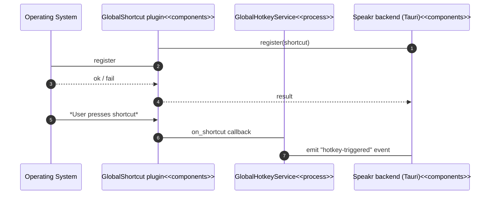

# Implementation Report: FR-1 - Global Hot-key

## Implementation Summary

The backend (`speakr-tauri`) integrates **tauri-plugin-global-shortcut** to register a system-wide
shortcut at start-up.  A default combination (`CmdOrCtrl+Alt+Space`) is attempted first; if
registration fails (for example due to a conflict) a fallback (`CmdOrCtrl+Alt+F2`) is tried.  The
registration logic is implemented in `GlobalHotkeyService`
(`speakr-tauri/src/services/hotkey.rs`) and invoked from `speakr-tauri/src/lib.rs` inside the
`setup` callback.  The service stores the active shortcut behind a mutex and emits a
**`hotkey-triggered`** Tauri event each time the key is pressed.

Validation utilities (`commands::validation::validate_hot_key_internal`) together with the
`HotkeyConfig` type (defined in `speakr-types`) provide parsing and serialisation support.  A
comprehensive suite of unit tests exercises many shortcut formats, as well as default configuration
behaviour and placeholder Tauri integration scenarios.

## Work Remaining

1. **Trigger pipeline** – wire the `hotkey-triggered` event to the _record → transcribe → inject_
   flow (FR-2, FR-3, FR-4).
2. **Settings integration** – load a user-defined shortcut from persisted settings at start-up and
   expose a Tauri command that re-registers it at runtime.
3. **Conflict feedback** – propagate `HotkeyError::ConflictDetected` to the UI so users are warned
   instantly.
4. **Configurable modifier** – change the default shortcut to match the PRD (`⌥ Option + ~`) and
   let users restore defaults easily.
5. **Cross-platform assurance** – create integration tests with a mocked `AppHandle` or CI desktop
   harness to confirm registration works on macOS, Windows and Linux.
6. **Performance metric** – measure and emit telemetry needed for the 95th-percentile
   **time-to-text ≤ 3 s** requirement (once the pipeline is complete).

## Architecture

### Sequence – current implementation



### Target flow – requirement goal

```mermaid
flowchart TD
    Input["User presses global hot-key"]::inputOutput --> Shortcut(Registered shortcut)<<components>>
    Shortcut --> |Tauri event| Record["Audio capture start"]::process
    Record --> Transcribe["Whisper transcription"]::process
    Transcribe --> Inject["Text injection into active field"]::process
    classDef inputOutput fill:#FEE0D2,stroke:#E6550D,color:#E6550D
    classDef process fill:#EAF5EA,stroke:#C6E7C6,color:#77AD77
    classDef components fill:#E6E6FA,stroke:#756BB1,color:#756BB1
```

## Noteworthy

* The current default shortcut differs from the PRD specification.  A TODO in code highlights the
  pending pipeline integration.
* Unit tests follow TDD principles, yet integration tests with the real plugin are still
  placeholders.

## Related Requirements

* [FR-2-audio-capture](../FR-2-audio-capture.md)
* [FR-3-transcription](../FR-3-transcription.md)
* [FR-4-text-injection](../FR-4-text-injection.md)
* [FR-8-settings-persistence](../FR-8-settings-persistence.md)

## References

* [tauri-plugin-global-shortcut](https://github.com/tauri-apps/tauri-plugin-global-shortcut)
* [Tauri Events](https://tauri.app/v2/api/rust/tauri/struct.AppHandle)
