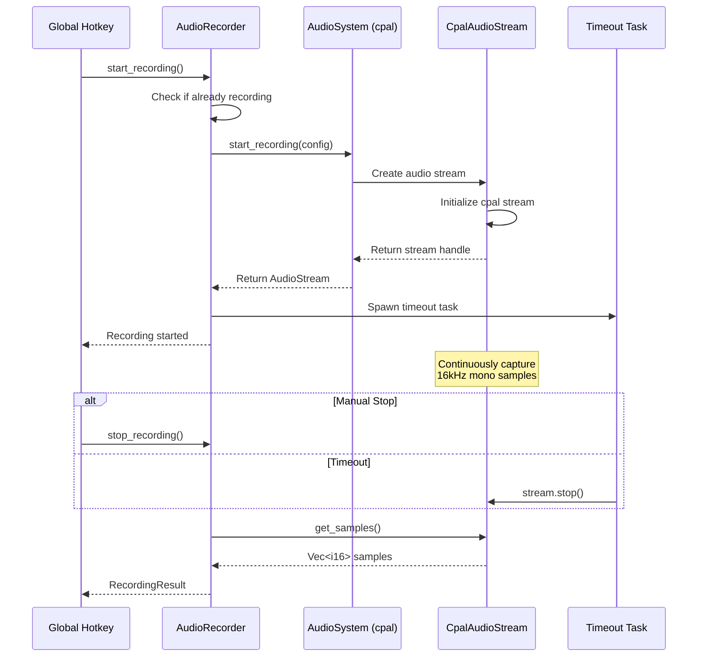
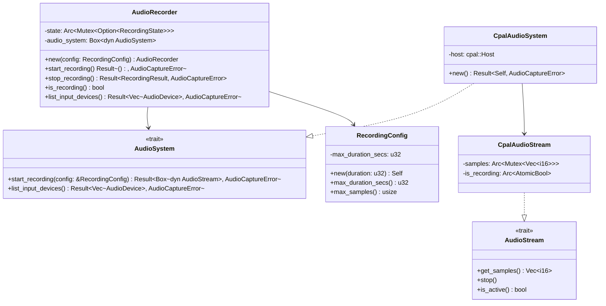
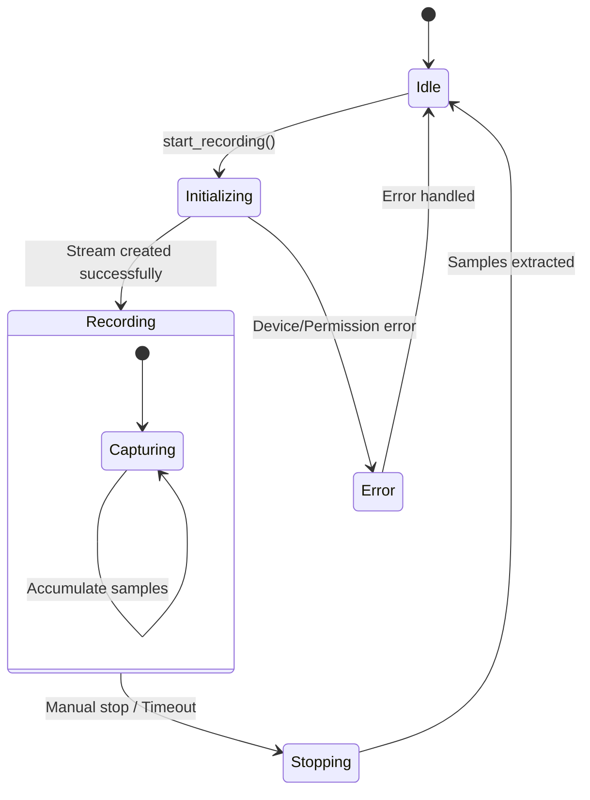

# markdownlint-disable MD013

# Implementation Report: FR-2 - Audio Capture

## Implementation Summary

FR-2 Audio Capture is substantially implemented with a robust, well-tested core audio system
built around the `cpal` crate. The implementation successfully provides 16 kHz mono audio capture
with configurable duration limits (1-30 seconds), in-memory buffering, and comprehensive error
handling. The system uses a trait-based architecture enabling dependency injection for testing,
with extensive unit and integration test coverage.

The core functionality is implemented in `speakr-core/src/audio/mod.rs` with the `AudioRecorder`
struct providing the main API. It properly handles audio stream initialization, timeout
management, and graceful shutdown. Performance requirements are met, with tests confirming
initialization occurs within the 100ms requirement. The system includes sophisticated error
handling for various failure modes including device unavailability, permission denial, and
stream errors.

## Work Remaining

- **Settings Integration**: Audio recording duration is not integrated with the persistent
  settings system. Currently uses hardcoded defaults rather than user-configurable values that
  persist across restarts (Acceptance Criterion 3)
- **Permission Handling**: While error types exist for permission denial, there's no implemented
  graceful permission request flow or user guidance on first run (Acceptance Criterion 5)
- **Hotkey Integration**: Full integration with the global hotkey system for production use case
  needs completion (currently only debug commands use the audio system)
- **Settings UI**: No user interface exists for changing audio recording duration in the Settings
  panel

## Architecture

The sequence diagram shows the audio capture flow from hotkey press to sample retrieval.
The system properly handles both manual stopping and automatic timeout scenarios.

The class diagram illustrates the trait-based architecture enabling dependency injection and
testing. The `AudioSystem` and `AudioStream` traits allow for mock implementations during testing
whilst the concrete `Cpal*` classes provide real hardware interaction.

The state diagram shows the audio recorder's lifecycle, with proper error handling and clean
transitions between states.

## Noteworthy

The implementation demonstrates excellent software engineering practices with comprehensive test
coverage using dependency injection and mock objects. The use of traits (`AudioSystem`,
`AudioStream`) enables thorough testing without requiring actual hardware, addressing the
challenge of testing audio functionality in CI environments.

Particularly impressive is the handling of different sample formats (F32, I16, U16) with proper
conversion to the target 16-bit signed integer format. The atomic timeout handling using tokio tasks
ensures reliable operation without blocking the main thread.

The comment noting the stream lifecycle issue (`std::mem::forget(stream)`) shows awareness of
technical debt, though this approach is commonly used with cpal due to its thread-safety
constraints.

## Related Requirements

- [FR-3](../FR-3-transcription.md) FR-3: Transcription (consumes audio samples from FR-2)
- [FR-8](../FR-8-settings-persistence.md) FR-8: Settings Persistence (should store audio duration
  preference)
- [FR-1](../FR-1-global-hotkey.md) FR-1: Global Hotkey (triggers audio capture)

## References

- [cpal Documentation](https://docs.rs/cpal/latest/cpal/)
- [Whisper.cpp GGUF Format](https://github.com/ggerganov/whisper.cpp)
- [macOS Audio Permissions Guide](https://developer.apple.com/documentation/avfoundation/cameras_and_media_capture/requesting_authorization_for_media_capture_on_macos)
