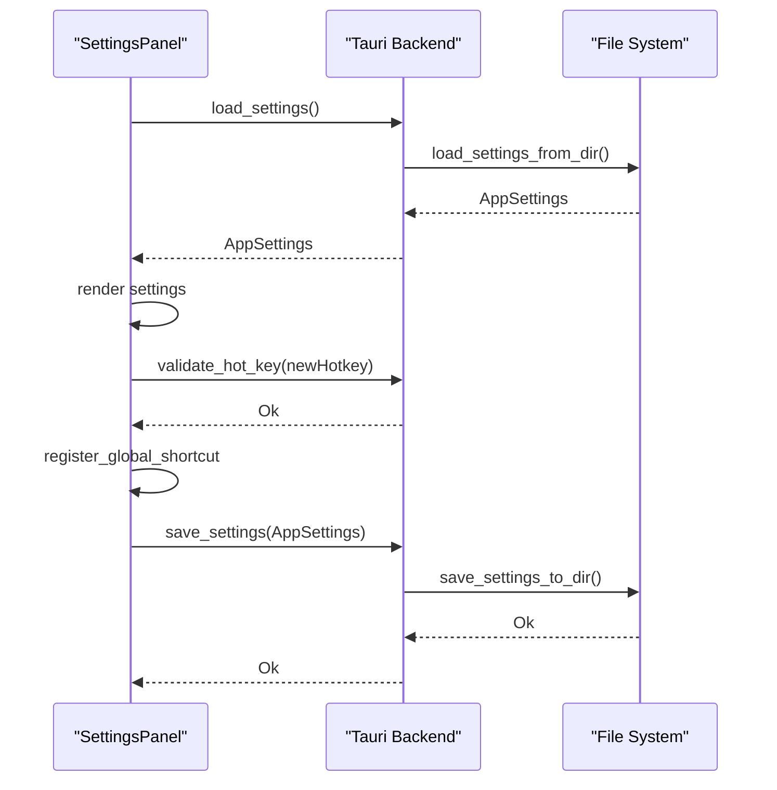
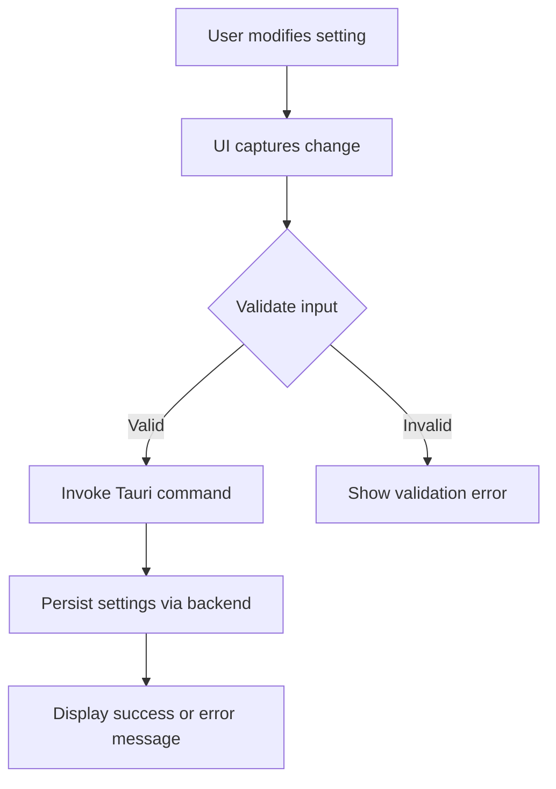

# Implementation Report: FR-6 - Settings UI

## Implementation Summary

The `SettingsPanel` Leptos component serves as the primary settings interface for Speakr. On launch,
it invokes the Tauri `load_settings` command to retrieve persisted `AppSettings` and renders:

- **Global hot-key configuration**: Real-time validation via the `validate_hot_key` Tauri command,
  un/registration through the global-shortcut plugin, and persistence via `save_settings`.
- **Model selection**: Radio options for small, medium, and large Whisper models, availability
  checks using `check_model_availability`, disabling unavailable models, and immediate persistence.
- **Auto-launch toggle**: Uses the `set_auto_launch` Tauri command and calls `save_settings` on
  change.

All changes trigger `save_settings` and display inline success or error messages. Backend
persistence is handled atomically in `settings/persistence.rs`. Hot-key and auto-launch preferences
apply at runtime without restarting the app.

## Work Remaining

- Add a system tray icon and a “Settings” menu item to open or focus the settings window.
- Implement Tauri `system_tray` integration and event handling in `run()` to show/hide the settings
  window.
- Enable dynamic transcription-model reload in the backend when `model_size` changes, without
  requiring a restart.
- Develop unit/UI tests for each settings control and validation path (hot-key, model selection,
  auto-launch).
- Measure and optimise settings window startup to meet the <200 ms opening requirement.
- Enhance the hot-key picker with an interactive key-capture control instead of free-text input.
- Display inline errors for model selection failures (e.g., missing or corrupt model files).

## Architecture

### Sequence Diagram

### Flowchart

## Noteworthy

N/A

## Related Requirements

- [FR-1](../FR-1-global-hotkey.md) Global Hotkey
- [FR-3](../FR-3-transcription.md) Transcription
- [FR-8](../FR-8-settings-persistence.md) Settings Persistence

## References

- `speakr-ui/src/settings.rs`
- `speakr-tauri/src/lib.rs`
- `speakr-tauri/tauri.conf.json`
